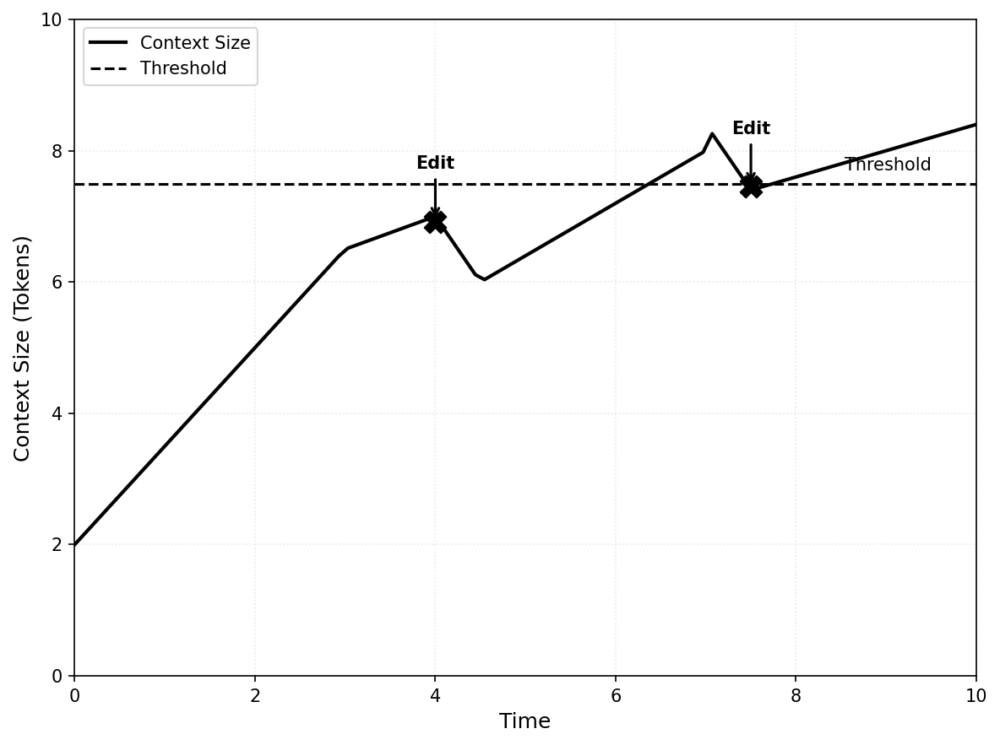

# Pattern: Context Editing

## Motivation

As conversations grow, context accumulates: tool results pile up, thinking blocks expand, and message history lengthens. 
Without intervention, agents hit token limits, costs escalate, and performance degrades. 
Just as editors trim manuscripts to focus on essential content, Context Editing automatically manages conversation context as it grows, removing less critical information while preserving what matters most. 
This pattern enables agents to operate indefinitely within context limits through intelligent, automatic pruning.

## Pattern Overview
**What it is:** Context editing automatically manages conversation context as it grows, removing or compressing less critical content (tool results, thinking blocks, old messages) to stay within token limits and optimize costs.

**When to use:** When building long-running agents that accumulate extensive conversation history, tool results, or thinking blocks that would exceed context window limits or degrade performance over time. 
Essential for preventing **Context Rot** by proactively managing context before performance degradation occurs.

**Why it matters:** Without automatic context management, agents hit hard token limits, incur excessive costs from processing large contexts, and suffer performance degradation.

> **"The context window is the agent's working memory — its RAM."** — Andrej Karpathy

> **"Context engineering is the art of filling the window with exactly what the model needs for the next action."** — Andrej Karpathy

Context editing enables agents to operate indefinitely while maintaining focus on relevant information.

Context editing is a core component of context engineering—the discipline of strategically managing what information appears in the context window to optimize performance, cost, and reasoning quality.

> **"Prompt engineering is dead; it has become context engineering."** — Andrej Karpathy 
Unlike explicit compression techniques that require explicit function calls, context editing operates automatically based on configurable thresholds, removing or summarizing content when limits are exceeded. 
The technique can be applied at different points in the pipeline—before prompts reach the model (API-level) or through SDK-based processing—but the core mechanism is the same: monitor context size, apply editing strategies when thresholds are exceeded, and preserve essential information while removing or compressing less critical content.
Context editing is a key technique for preventing **Context Rot**—the performance degradation that occurs as context windows fill up, even within technical token limits.

> **"Anything beyond ~200k tokens leads to *context rot* — the model forgets what matters."** — Manus Creators

> **"The most powerful design lever in agents today is *context curation*, not more compute."** — Manus Creators

The technique can be configured for different editing strategies:

1. **Content-specific clearing:** Remove specific content types (tool results, thinking blocks) based on configurable thresholds and retention policies, replacing them with placeholders.
2. **Full history compaction:** Replace entire conversation history with a structured summary when token thresholds are exceeded, enabling agents to continue from a compressed state.

Both strategies maintain conversation continuity while managing context size, ensuring agents can operate effectively over extended interactions without manual intervention.

### Key Concepts

- **Tool Result Clearing:** Automatically removing tool results from conversation history when context exceeds thresholds, replacing them with placeholder text to indicate removal.
- **Thinking Block Clearing:** Managing extended thinking blocks by clearing older thinking content while preserving recent reasoning.
- **History Compaction:** Summarization that replaces full conversation history with a structured continuation summary when token limits are approached.
- **Restorable References:** Maintaining lightweight references (file paths, keys) for cleared content that can be retrieved on demand.
- **Context Thresholds:** Configurable token limits that trigger automatic editing operations.
- **Retention Policies:** Rules specifying what content to keep (e.g., last N tool uses, all thinking blocks, recent messages) during editing operations.

### How It Works: Step-by-step Explanation

Context editing follows a consistent process regardless of where it's applied in the pipeline:

1. **Monitor Context Size:** Track token usage as the conversation progresses, comparing against configured thresholds.

2. **Trigger Editing:** When context exceeds the threshold (e.g., 30,000 input tokens), activate the configured editing strategy.

3. **Apply Strategy:** Based on the strategy type:

    - **Content-Specific Clearing:** Remove oldest tool results or thinking blocks chronologically, replacing with placeholders like "[Tool result cleared]". Optionally clear tool inputs as well. Preserve recent content based on retention policy (e.g., keep last N turns, keep all, or keep none).
    
    - **Full History Compaction:** Generate a structured continuation summary including task overview, current state, important discoveries and decisions, next steps, and context to preserve. Replace entire conversation history with the summary message.

4. **Preserve References:** Maintain lightweight references for cleared content (file paths, URLs) that enable retrieval if needed.

5. **Continue Conversation:** The model receives the edited context and continues normally, with cleared content replaced by placeholders or summaries.

## Relationship to Context Compression

Context Editing is a **specific automatic technique** within the broader Context Compression strategy. Understanding this relationship helps clarify when to use automatic vs explicit approaches.

### Context Editing as Automatic Technique

Context Editing focuses on **automatic, hands-off management** of context size. It's part of the broader Context Compression strategy, which includes both:

- **Automatic techniques** (Context Editing): Threshold-based content-specific clearing or full history compaction that runs automatically when configured limits are exceeded
- **Explicit techniques**: Strategic summarization, pruning, and externalization decisions made by the agent or system code through explicit function calls

### When to Use Context Editing vs Explicit Compression

**Use Context Editing when:**

- You want automatic, set-and-forget context management
- Tool-heavy workflows where tool results accumulate quickly
- Long-running conversations that need continuous management
- You prefer configuration-based triggers over explicit function calls
- You need consistent, predictable context size management

**Use Explicit Compression when:**

- You need fine-grained control over what gets compressed and when
- Strategic summarization is required (e.g., preserving specific information)
- You want to combine multiple compression techniques with custom logic
- You need to make compression decisions based on content analysis
- You're implementing custom compression strategies beyond automatic threshold-based clearing

**Combine Both:**

- Use Context Editing for automatic tool result clearing
- Use explicit compression for strategic conversation summarization
- This provides both automatic management and explicit control

### Context Editing vs Filesystem as Context

**Context Editing** automatically manages content that's already in context (clearing tool results, thinking blocks).

**Filesystem as Context** externalizes large data before it enters context (offloading to persistent storage).

**How they work together:**

- Externalize large data first using Filesystem as Context
- Let Context Editing automatically clear old tool result references
- Maintain references to externalized content for restorable compression

## When to Use This Pattern

### ✅ Use when:

- Building long-running agents that process many files, conduct extensive research, or execute multi-step tasks.
- Tool-heavy workflows where tool results accumulate quickly and consume significant context.
- Using extended thinking features where thinking blocks grow over time.
- Cost optimization is critical and large contexts are expensive to process repeatedly.
- Agents need to operate indefinitely without hitting hard token limits.
- Conversation history grows beyond optimal context sizes (typically 50K+ tokens).

### ❌ Avoid when:
- Tasks are short-lived or single-turn, making automatic editing unnecessary.
- All context is critical and cannot be safely removed or summarized.
- Real-time retrieval of cleared content is required and latency is unacceptable.
- Using server-side tools extensively (compaction may trigger incorrectly due to cache token counting).
- Tasks require precise recall of early conversation details that would be lost in summarization.

### Decision Guidelines
Context editing is essential for production agents handling long-running tasks. Choose content-specific clearing for fine-grained control over what gets cleared (tool results, thinking blocks) while preserving conversation structure. Use full history compaction for more aggressive compression when full history replacement is acceptable. Consider: content type (tool results = content-specific clearing, full history = compaction), retrieval needs (cleared content = maintain references, summarized = accept information loss), and cache optimization (preserving thinking blocks = better cache hits). Always configure thresholds conservatively (e.g., 80-90% of max tokens) to prevent hard failures.



## Practical Applications & Use Cases

Context editing is fundamental to building scalable, cost-effective agent systems across diverse applications.

- **Research Agents:** Agents conducting literature reviews automatically clear old search results while preserving recent findings and maintaining references to externalized papers.
- **Code Generation Agents:** Systems processing large codebases clear tool results from file operations, keeping only summaries and file paths for on-demand retrieval.
- **Long-Running Conversations:** Chatbots and assistants automatically manage conversation history, clearing old messages while preserving essential context through summarization.
- **Planning Agents:** Agents with extended thinking clear older thinking blocks while preserving recent reasoning, maintaining cache efficiency for prompt caching.
- **Multi-Agent Systems:** Orchestrator agents clear subagent outputs automatically, storing detailed results externally and keeping only summaries in context.
- **Tool-Heavy Workflows:** Agents using many tools (web search, file operations, API calls) automatically clear old tool results to prevent context bloat.
- **Cost-Sensitive Applications:** Production systems optimize costs by automatically managing context size, reducing token consumption without manual intervention.


## Implementation

### Prerequisites
```bash
pip install langchain langchain-openai langgraph
# or
pip install langchain langchain-google-genai langgraph
# or
pip install google-adk
```

??? "Basic Example: Context Editing with LangGraph Middleware"

    ```python
    from langchain.agents import create_agent
    from langchain.agents.middleware import BaseMiddleware
    from langchain_core.messages import BaseMessage, ToolMessage
    from langchain_openai import ChatOpenAI
    from langchain_core.tools import tool
    from typing import List, Dict, Any
    import tiktoken

    @tool
    def search_web(query: str) -> str:
        """Search the web for information."""
        return f"Search results for: {query}"

    class ContextEditingMiddleware(BaseMiddleware):
        def __init__(self, token_threshold: int = 30000, keep_last_n: int = 3):
            super().__init__()
            self.token_threshold = token_threshold
            self.keep_last_n = keep_last_n
            self.encoding = tiktoken.get_encoding("cl100k_base")
        
        def count_tokens(self, messages: List[BaseMessage]) -> int:
            return sum(
                len(self.encoding.encode(str(msg.content)))
                for msg in messages if hasattr(msg, 'content')
            )
        
        async def on_agent_step_start(self, state: Dict[str, Any], **kwargs) -> Dict[str, Any]:
            if "messages" not in state:
                return state
            
            messages = state["messages"]
            if self.count_tokens(messages) >= self.token_threshold:
                tool_messages = [(i, msg) for i, msg in enumerate(messages) if isinstance(msg, ToolMessage)]
                if len(tool_messages) > self.keep_last_n:
                    edited = messages.copy()
                    for idx, _ in tool_messages[:-self.keep_last_n]:
                        edited[idx] = ToolMessage(content="[Cleared]", tool_call_id=edited[idx].tool_call_id)
                    return {**state, "messages": edited}
            return state

    llm = ChatOpenAI(model="gpt-4o", temperature=0)
    agent = create_agent(
        model=llm,
        tools=[search_web],
        middleware=[ContextEditingMiddleware(token_threshold=30000, keep_last_n=3)]
    )

    result = agent.invoke({"messages": [{"role": "user", "content": "Research AI agents"}]})
    ```

**Explanation:**
This middleware automatically clears old tool results when context exceeds 30,000 tokens, keeping only the last 3. This enables agents to operate indefinitely without hitting token limits.

### Framework-Specific Examples

??? "LangGraph: Advanced Context Editing"

    ```python
    from langchain.agents import create_agent
    from langchain.agents.middleware import BaseMiddleware
    from langchain_core.messages import BaseMessage, ToolMessage, HumanMessage
    from langchain_openai import ChatOpenAI
    from langchain_core.tools import tool
    from typing import List, Dict, Any, Optional
    import tiktoken

    @tool
    def web_search(query: str) -> str:
        """Search the web."""
        return f"Results: {query}"

    class AdvancedContextEditingMiddleware(BaseMiddleware):
        def __init__(
            self,
            tool_threshold: int = 50000,
            keep_last_n: int = 5,
            exclude_tools: Optional[List[str]] = None
        ):
            super().__init__()
            self.tool_threshold = tool_threshold
            self.keep_last_n = keep_last_n
            self.exclude_tools = exclude_tools or []
            self.encoding = tiktoken.get_encoding("cl100k_base")
        
        def count_tokens(self, messages: List[BaseMessage]) -> int:
            return sum(len(self.encoding.encode(str(msg.content))) for msg in messages if hasattr(msg, 'content'))
        
        async def on_agent_step_start(self, state: Dict[str, Any], **kwargs) -> Dict[str, Any]:
            if "messages" not in state:
                return state
            
            messages = state["messages"]
            if self.count_tokens(messages) >= self.tool_threshold:
                tool_messages = [
                    (i, msg) for i, msg in enumerate(messages)
                    if isinstance(msg, ToolMessage) and msg.name not in self.exclude_tools
                ]
                if len(tool_messages) > self.keep_last_n:
                    edited = messages.copy()
                    for idx, _ in tool_messages[:-self.keep_last_n]:
                        edited[idx] = ToolMessage(content="[Cleared]", tool_call_id=edited[idx].tool_call_id)
                    return {**state, "messages": edited}
            return state

    llm = ChatOpenAI(model="gpt-4o", temperature=0)
    agent = create_agent(
        model=llm,
        tools=[web_search],
        middleware=[AdvancedContextEditingMiddleware(
            tool_threshold=50000,
            keep_last_n=5,
            exclude_tools=["web_search"]
        )]
    )

    result = agent.invoke({"messages": [{"role": "user", "content": "Research multiple topics"}]})
    ```

    #### Google ADK: Session State Compression

    ```python
    from google.adk.agents import Agent
    from google.adk.runners import Runner
    from google.adk.sessions import InMemorySessionService

    def compress_context(state: dict, max_tokens: int = 80000) -> dict:
        messages = state.get("messages", [])
        if len(messages) > 20:  # Simple heuristic
            state["messages"] = [
                {"role": "system", "content": "[Previous conversation summarized]"}
            ] + messages[-10:]
        return state

    session_service = InMemorySessionService()
    session_service.add_compression_hook(compress_context)

    agent = Agent(
        name="CompressedAgent",
        model="gemini-2.0-flash",
        instruction="Work efficiently within context limits."
    )

    runner = Runner(
        agent=agent,
        app_name="compressed_app",
        session_service=session_service
    )
    ```

    #### Google ADK: Session State Compression

    ```python
    from google.adk.sessions import InMemorySessionService
    from google.adk.agents import LlmAgent
    from google.adk.runners import Runner
    from google.adk.middleware import ContextCompressionMiddleware

    def compress_context(state: dict, max_tokens: int = 80000) -> dict:
        """Compress session context when it exceeds token limit."""
        # Count tokens in messages
        total_tokens = estimate_tokens(str(state.get("messages", [])))
        
        if total_tokens > max_tokens:
            # Keep recent messages, summarize old ones
            messages = state.get("messages", [])
            recent = messages[-10:]  # Last 10 messages
            old = messages[:-10]
            
            # Summarize old messages
            summary = summarize_messages(old)
            
            # Replace with summary + recent
            state["messages"] = [
                {"role": "system", "content": f"Previous conversation: {summary}"}
            ] + recent
        
        return state

    session_service = InMemorySessionService()
    session_service.add_compression_hook(compress_context)

    agent = LlmAgent(
        name="CompressedAgent",
        model="gemini-2.0-flash",
        instruction="Work efficiently within context limits."
    )

    runner = Runner(
        agent=agent,
        app_name="compressed_app",
        session_service=session_service
    )
    ```


## Key Takeaways

- **Core Strategy:** Context editing automatically manages conversation context as it grows, removing or compressing less critical content to stay within token limits and optimize costs.
- **Two Strategies:** Content-specific clearing (removing tool results/thinking blocks) provides fine-grained control, while full history compaction (summarization) offers more aggressive compression.
- **Automatic Operation:** Unlike explicit compression that requires explicit function calls, context editing operates automatically based on configurable thresholds, enabling agents to run indefinitely without explicit intervention.
- **Preserve References:** When clearing content, maintain lightweight references (file paths, URLs) that enable on-demand retrieval if needed.
- **Cache Optimization:** Preserving thinking blocks and maintaining stable prefixes improves prompt cache efficiency, reducing costs and latency.
- **Common Pitfall:** Aggressive editing that removes critical information or fails to maintain restorable references defeats the purpose. Always configure retention policies appropriately.
- **Best Practice:** Set thresholds conservatively (80-90% of max tokens) and configure retention policies (keep last N tool uses, preserve recent thinking) to prevent information loss while managing context size.
- **Cost Impact:** Effective context editing directly reduces token consumption and API costs by keeping contexts focused and within optimal ranges.

## Related Patterns

This pattern works well with:

- **Context Compression:** Context editing is a specific automatic technique within the broader context compression strategy. Use Context Editing for automatic threshold-based management, and explicit compression for strategic summarization.
- **Filesystem as Context:** Cleared tool results can reference externalized content, enabling restorable compression through the filesystem pattern. **Combination workflow:** Externalize large tool results to files first (Filesystem as Context), then let Context Editing automatically clear old tool result references when context grows. The cleared references point to externalized files, maintaining restorable compression.
- **Memory Management:** Context editing is a key component of comprehensive memory management, specifically for managing short-term memory (context window). It complements external memory (Filesystem as Context, RAG) and other compression techniques.
- **Tool Result Management:** Context editing automatically manages tool results, clearing old ones while preserving recent outputs and references. This is particularly effective when combined with Filesystem as Context for restorable compression.

This pattern is often combined with:

- **Stable, Append-Only Context:** Context editing maintains conversation structure while clearing content, preserving KV-Cache efficiency.
- **Recitation:** Agents can recite important plans or goals into context after editing operations to maintain focus.
- **Multi-Agent Architectures:** Orchestrators use context editing to manage subagent outputs, keeping summaries while clearing detailed results.

??? "References"

    - Context Engineering for AI Agents: The Complete Guide - https://medium.com/@khanzzirfan/context-engineering-for-ai-agents-the-complete-guide-5047f84595c7
    - Context Engineering Guide - https://www.promptingguide.ai/guides/context-engineering-guide
    - LangGraph Middleware Documentation - https://langchain-ai.github.io/langgraph/how-tos/middleware/
    - LangChain Agents Middleware - https://docs.langchain.com/oss/python/langchain/agents/middleware/
    - Context Compression Techniques: Managing the Finite Window
    - Memory Management: Strategies for Context Windows and External Memory

