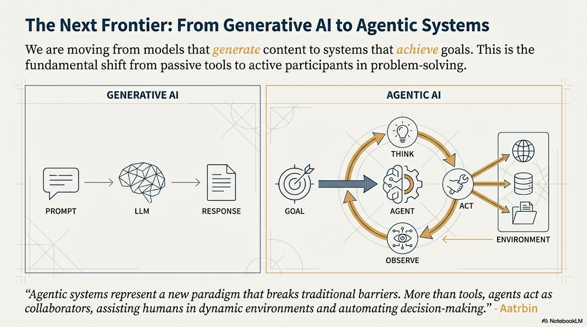

# Introduction: Foundations of Agentic Systems

## The Paradigm Shift

We are standing on the precipice of a transformation in artificial intelligence that is as significant as the move from command-line interfaces to graphical user interfaces. As AI systems shift from **passive classifiers to active problem-solvers**, engineers face a critical challenge: building intelligent agents requires not just technical skills, but a deeper understanding of *how intelligence works*.

> **"Agents are software 3.0 — programs that you don't write, but steer."** — Andrej Karpathy

We are moving from models that simply generate content to systems that **achieve goals**. This is the fundamental shift from passive tools to active participants in problem-solving.

> **"We are entering a world where computers behave like people: browsing, clicking, copying, pasting, planning."** — Andrej Karpathy Large language models augmented with tools, memory, and multi-step reasoning are increasingly deployed as agents capable of planning, acting, and coordinating with humans and other agents. Yet despite rapid progress, the field lacks a **shared conceptual framework** that provides AI agent engineers with a common language that revolves around the key components of intelligence.

For the past few years, the spotlight has been on **Generative AI**. These models are impressive; they can write poetry, debug code, and summarize history. However, they remain fundamentally reactive. They wait for input, process it, and return output. They are stateless oracles.

**Agentic AI** changes the equation. It moves beyond text generation into the realm of action. An agent doesn't just say what *should* be done; it attempts to *do* it.

### Generative AI
* **Flow:** `Prompt -> LLM -> Response`
* **Nature:** Passive, one-shot, content-focused.
* **Role:** The human drives the process. The human must verify the output and perform the subsequent action. The model is a fancy autocomplete engine.

### Agentic AI
* **Flow:** `Goal -> Agent (Think -> Act -> Observe Loop) -> Environment -> Goal Achieved`
* **Nature:** Active, iterative, goal-focused.
* **Role:** The agent drives the process. It acts as a collaborator or an employee. It doesn't just answer a question; it navigates a problem space, corrects its own errors, and interacts with external software.

> "Agentic systems represent a new paradigm that breaks traditional barriers. More than tools, agents act as collaborators, assisting humans in dynamic environments and automating decision-making." - Aatrbin

---

## A New Era of Software Engineering

This shift represents a **fundamental transition in software engineering**: from building systems that manage data flow to building systems that **embody intelligence**. Building systems that must themselves decompose general problems, intelligently select solvers for subproblems, and synchronize cognitive states across multiple reasoning steps represents a qualitatively different class of engineering problem than coordinating data pipelines or distributed processes.

It introduces novel challenges directly related to the limits of LLMs—challenges that traditional software engineering never faced. Effective context engineering, for instance, was not a problem in traditional software engineering. How do you manage working memory constraints? How do you allocate cognitive load across reasoning steps? How do you maintain executive control in multi-agent systems? These are questions that cognitive neuroscience has been studying for decades, and they are now central to building effective agentic systems.

> **"Agents require an operating system of their own. The UX for AIs will not be the UX for humans."** — Andrej Karpathy

> **"AI is becoming a collaborator, not a component."** — Andrej Karpathy

**Thus, a new conceptual language is needed**, one that provides engineers with the vocabulary to reason about these cognitive operations. This gap has practical consequences. Engineers building agentic systems must make countless design decisions: how to decompose tasks, manage context, allocate work to tools, coordinate multi-step workflows, and enable learning. They lack a unified cognitive framework to guide these choices. Without a shared conceptual language, each team reinvents patterns, struggles to communicate design decisions, and misses opportunities to learn from decades of cognitive science research on how biological minds solve similar problems.

## The Evolution of AI Systems

The journey from simple language models to sophisticated agentic systems has been rapid and transformative. In just a few years, we've witnessed a dramatic evolution:

**Phase 1: Basic LLMs** - Simple prompt-response interactions with no external capabilities.

**Phase 2: RAG (Retrieval-Augmented Generation)** - Enhanced reliability by grounding models on factual information from knowledge bases.

**Phase 3: Individual AI Agents** - Agents capable of using various tools, planning, and executing multi-step tasks.

**Phase 4: Agentic AI** - Teams of specialized agents working in concert to achieve complex goals, marking a significant leap in AI's collaborative power.

> **"LLMs were step one. Agents are step two. Ecosystems are step three."** — Anthropic

This evolution reflects a fundamental shift from static automation to dynamic, intelligent systems that can adapt, learn, and collaborate. The market reflects this transformation: AI agent startups raised over $2 billion by the end of 2024, with the market valued at $5.2 billion and projected to reach nearly $200 billion by 2034. According to recent studies, a majority of large IT companies are actively using agents, with a fifth of them starting within just the past year.

---

## Defining the Landscape: Workflows vs. Agents

Before building, we must understand the architectural distinction. In the rush to adopt "agents," many engineers misclassify their systems. The difference lies in who controls the flow of execution: the code or the model. One follows a script; the other writes its own.

### Workflows (Pipelines)
Workflows are systems where LLMs and tools are orchestrated through predefined code paths. Imagine a rigid flow chart. The LLM is used as a processing unit (a "cognitive engine") at specific nodes, but the edges between nodes are hardcoded.

* **Structure:** `Input -> Step A -> Step B -> Step C -> Output`
* **Characteristics:** Predictable, consistent, ideal for well-defined tasks. If step A fails, the system likely throws a standard exception.
* **Control:** The path is hardcoded by the engineer.
* **Example:** A system that takes a PDF, summarizes it using an LLM, translates the summary, and emails it. The LLM never decides *what* to do next; it only does what the script commands.

### Agents
Agents are systems where LLMs dynamically direct their own processes and tool usage, maintaining control over how they accomplish tasks. The engineer defines the *tools* and the *goal*, but the agent defines the *path*.

* **Structure:** `Start -> Decision -> Task A OR Task B -> Observation -> Next Decision -> Goal`
* **Characteristics:** Flexible, adaptive, ideal for open-ended problems where the solution path is unknown.
* **Control:** The LLM decides the path at runtime.
* **Example:** A system asked to "Find out why the server crashed." The agent might choose to check logs, or it might choose to check recent code commits. It decides its next step based on the result of the previous step.

> **"Determinism comes not from the LLM, but from the graph around it."** — LangChain / LangGraph

> **Note:** Simply augmenting an LLM with modules, tools, or predefined steps does not make it an agent; in any case, that would make it a workflow. If the "if/else" logic is in your Python code, it's a workflow. If the "if/else" logic is generated by the LLM, it's an agent.

---

## What Makes an AI System an Agent?

In simple terms, an AI agent is a system designed to perceive its environment and take actions to achieve a specific goal. It's an evolution from a standard Large Language Model (LLM), enhanced with the abilities to plan, use tools, and interact with its surroundings.

> **"An agent is a loop: perceive → think → act → observe → update."** — Anthropic Engineers

> **"Agents are control systems built from LLMs."** — LangChain / LangGraph

Think of an Agentic AI as a smart assistant that learns on the job. It follows a simple, five-step loop to get things done:

1. **Get the Mission:** You give it a goal, like "organize my schedule."
2. **Scan the Scene:** It gathers all the necessary information—reading emails, checking calendars, and accessing contacts—to understand what's happening.
3. **Think It Through:** It devises a plan of action by considering the optimal approach to achieve the goal.
4. **Take Action:** It executes the plan by sending invitations, scheduling meetings, and updating your calendar.
5. **Learn and Get Better:** It observes successful outcomes and adapts accordingly. For example, if a meeting is rescheduled, the system learns from this event to enhance its future performance.

### Core Characteristics of Agents

Agents are characterized by several key capabilities:

* **Autonomy:** Agents can operate without constant human oversight, making decisions and taking actions independently.
* **Proactiveness:** Agents initiate actions toward their goals rather than merely reacting to inputs.
* **Reactivity:** Agents respond effectively to changes in their environment.
* **Goal-Orientation:** Agents are fundamentally focused on achieving specific objectives.
* **Tool Use:** Agents can interact with external APIs, databases, or services, extending beyond their immediate context.
* **Memory:** Agents retain information across interactions, maintaining context and learning from experience.
* **Communication:** Agents can engage with users, other systems, or other agents.

---

## The Anatomy of an Agent

We can understand agentic patterns by mapping them to the core components of an intelligent system. This book is structured around building an agent, piece by piece, mirroring biological cognition. By grounding our framework in cognitive neuroscience, we can understand both the mechanisms and the underlying principles that explain their effectiveness. These components—memory, reasoning, tool use, and collaboration—are both necessary and sufficient for reliable, long-horizon problem solving in both biological and artificial agents.

### 1. Memory & Context (The Mind)
An agent is useless if it cannot remember previous actions or retrieve relevant knowledge.
* **Context Window:** The immediate "short-term" working memory.
* **History Management:** Mechanisms to summarize or truncate long conversations to fit within the window.
* **Memory Management:** Strategies for persistent memory and external storage to extend memory beyond immediate context.
* **Retrieval (RAG):** Long-term memory. This allows the agent to query vector databases to access documentation or past experiences, grounding its decisions in data rather than hallucinations.

### 2. Reasoning & Planning (The Brain)
How the agent thinks, plans, and makes decisions. This is the core loop.
* **Chain-of-Thought (CoT):** Encouraging the model to "show its work" before answering.
* **ReAct (Reason + Act):** A paradigm where the model generates a thought, performs an action, observes the output, and then reasons again.
* **Tree-of-Thoughts:** Exploring multiple possible future paths before committing to one, allowing for strategic foresight.

### 3. Tool Use & Execution (The Hands)
How the agent interacts with the world. Without tools, an agent is a brain in a jar.

> **"Tool-use is not a feature — it is the skeleton of an agent."** — Anthropic Engineers

> **"An agent is a *policy* over tools, wrapped around a language model."** — Manus Creators

* **Function Calling:** The mechanism by which an LLM generates structured JSON to execute code.
* **Capabilities:** This involves API calls (e.g., Stripe, Slack), file system manipulation (reading/writing code), and web browsing to fetch real-time data.

### 4. Multi-Agent Collaboration (Society of Minds)
For complex tasks, a single agent often fails due to context overload or lack of specialization.

> **"The challenge is not intelligence — it's *coordination*."** — Manus Creators

* **Orchestration:** A "manager" agent delegating tasks to "specialist" agents (e.g., a Coder, a Researcher, and a Reviewer).
* **Swarm Architectures:** Autonomous agents interacting to solve problems through consensus or division of labor.

---

## Levels of Agent Complexity

Agents can be categorized into different levels of sophistication, each building upon the previous:

### Level 0: The Core Reasoning Engine
While an LLM is not an agent in itself, it can serve as the reasoning core of a basic agentic system. In a 'Level 0' configuration, the LLM operates without tools, memory, or environment interaction, responding solely based on its pretrained knowledge. Its strength lies in leveraging its extensive training data to explain established concepts. The trade-off for this powerful internal reasoning is a complete lack of current-event awareness.

### Level 1: The Connected Problem-Solver
At this level, the LLM becomes a functional agent by connecting to and utilizing external tools. Its problem-solving is no longer limited to its pre-trained knowledge. Instead, it can execute a sequence of actions to gather and process information from sources like the internet (via search) or databases (via Retrieval Augmented Generation, or RAG). This ability to interact with the outside world across multiple steps is the core capability of a Level 1 agent.

### Level 2: The Strategic Problem-Solver
At this level, an agent's capabilities expand significantly, encompassing strategic planning, proactive assistance, and self-improvement. The agent moves beyond single-tool use to tackle complex, multi-part problems through strategic problem-solving. It performs context engineering: the strategic process of selecting, packaging, and managing the most relevant information for each step. This level leads to proactive and continuous operation, and the agent achieves self-improvement by refining its own context engineering processes.

### Level 3: The Rise of Collaborative Multi-Agent Systems
At Level 3, we see a significant paradigm shift, moving away from the pursuit of a single, all-powerful super-agent and towards sophisticated, collaborative multi-agent systems. This approach recognizes that complex challenges are often best solved not by a single generalist, but by a team of specialists working in concert. The collective strength of such a system lies in the division of labor and the synergy created through coordinated effort.

---

## Common Challenges in Agent Development

Building effective agentic systems introduces unique challenges that traditional software development doesn't face:

### 1. Reliability and Consistency
Agents operate probabilistically, making them inherently less predictable than deterministic code. The same input can produce different outputs, making testing and validation more complex.

### 2. Context Management
Agents must manage limited context windows while maintaining relevant information across long interactions. Balancing detail with efficiency is a constant challenge.

> **"Agent failures are almost always context failures."** — Manus

### 3. Error Handling and Recovery
When agents make mistakes or encounter unexpected situations, they need robust mechanisms to detect, understand, and recover from errors without human intervention.

### 4. Cost and Latency
Each LLM call consumes tokens and time. Complex agents making many sequential calls can become expensive and slow, requiring careful optimization.

### 5. Hallucination and Factual Accuracy
Agents can generate plausible but incorrect information. Ensuring accuracy requires careful design, grounding mechanisms, and validation.

### 6. Tool Integration Complexity
Agents must interact with diverse external systems, each with different APIs, error formats, and behaviors. Creating a consistent interface is challenging.

### 7. Coordination in Multi-Agent Systems
When multiple agents work together, managing communication, state sharing, and task coordination becomes complex.

These challenges are precisely why design patterns matter. They provide proven solutions to these recurring problems.

---

## Guiding Principles of Agentic Engineering

Success in the LLM space isn't about building the most sophisticated system. It's about building the *right* system for your needs. Agentic systems are prone to loops, hallucinations, and high costs. Adhering to these principles mitigates those risks.

### 1. Start Simple
Find the simplest solution possible, and only increase complexity when needed. Do not build an autonomous agent if a linear workflow suffices.

> **"Think of agents as interns: great potential, zero context. Give them both."** — Andrej Karpathy

* **Tradeoff:** Agentic systems trade latency (time) and cost (tokens) for better task performance and flexibility. They are slower and more expensive than workflows.
* **Advice:** Start with a prompt. If that fails, try a chain (workflow). Only if the path to the solution is highly variable should you build an agent.

### 2. Prioritize Transparency
Explicitly show the agent's planning steps (its "inner monologue").
* **Why:** This helps with debugging and builds user trust. If an agent fails, you need to know if it failed because it *reasoned* poorly or because a *tool* returned an error.
* **User Trust:** If users can see *why* an agent made a decision, they are more likely to accept the outcome, even if it takes longer to generate.

### 3. Craft the Agent-Computer Interface (ACI)
We have spent decades perfecting the Human-Computer Interface (HCI). We must now invest as much effort in creating a good Agent-Computer Interface (ACI).
* **The Concept:** Tools and APIs are the UI for the model. If an API is messy or poorly documented, the human developer might figure it out, but the Agent will hallucinate or fail.
* **Implementation:** This involves writing thorough tool documentation (which the LLM reads), clear docstrings, and robust error handling that returns meaningful error messages to the agent so it can self-correct.

### 4. Design for Failure
Assume things will go wrong and build resilience into your system from the start.
* **Error Recovery:** Implement retry mechanisms, fallback strategies, and graceful degradation.
* **Validation:** Check outputs before using them, validate tool results, and verify goal achievement.
* **Monitoring:** Consider tracking agent behavior, detecting anomalies, and measuring performance where appropriate.

### 5. Balance Autonomy with Control
Give agents enough autonomy to be effective, but maintain appropriate oversight and control mechanisms.

> **"An aligned model gives aligned outputs. An aligned agent gives aligned *actions*."** — Anthropic

* **Human-in-the-Loop:** Know when to involve humans for critical decisions or validation.

---

## Why Design Patterns Matter: A Cognitive Framework

Design patterns are battle-tested templates offering proven approaches to standard design and implementation challenges. The patterns presented in this book were extracted through careful analysis and dissection of real-world agent implementations, including systems like IBM's CUGA (Cognitive Understanding and Generation Agent). By examining how successful agent architectures are constructed, we've identified reusable patterns, design components, and principles that can be applied across different agentic systems. This pattern extraction methodology allows us to learn from proven implementations and codify their best practices into transferable knowledge.

However, this book goes further: it provides AI agent engineers with a **shared conceptual language grounded in cognitive neuroscience**, enabling you to build intelligent problem solvers with a common understanding of how intelligence works. At the same time, cognitive neuroscience has spent decades studying how humans break down complex problems, focus attention, delegate work to tools or collaborators, integrate partial results, and improve through experience. These theories offer deep insights into the **structure and limitations of intelligence**—working memory constraints, cognitive load, executive control bottlenecks.

> **"Graph structure is where reliability comes from."** — LangGraph

Until the recent surge of LLMs, these cognitive theories seldom translated cleanly into engineering practice. Conversely, AI agent frameworks (e.g., ReAct, RAG pipelines, LangGraph, multi-agent orchestration) provide pragmatic mechanisms for controlling LLM-based agents but often lack a unifying cognitive perspective that explains *why* certain patterns work and how they relate to fundamental principles of intelligence. By grounding agent design in cognitive principles, this framework helps engineers understand the limits of intelligence while inspiring effective solutions that map naturally onto existing agentic architectures.

> **"Good agents don't think more — they think *with better inputs*."** — Manus

In agentic systems, these patterns address fundamental questions:

* How do you structure sequential operations?
* How do you manage state and context within working memory constraints?
* How do you handle errors and unexpected situations?
* How do you coordinate multiple agents and allocate cognitive load?
* How do you ensure quality and safety?

By recognizing and applying these patterns with an understanding of their cognitive foundations, you gain access to solutions that enhance structure, maintainability, reliability, and efficiency. Patterns provide a common language that makes your agent's logic clearer and easier to understand, maintain, and extend. More importantly, this shared vocabulary—grounded in cognitive science—allows teams to reason about cognitive operations, understand the limits of intelligence, and communicate design decisions with a principled foundation.

Using design patterns helps you avoid reinventing fundamental solutions and accelerates development, allowing you to focus on the unique aspects of your application rather than foundational mechanics. By connecting engineering practice with cognitive principles, we can build more robust, reliable, and effective agentic systems.

---

## The Future of Agentic Systems

As we look ahead, several trends are shaping the future of agentic AI:

> **"Software will be written for humans and for AIs — two different users."** — Andrej Karpathy

* **Generalist Agents** - Evolution from narrow specialists to true generalists capable of managing complex, ambiguous, long-term goals
* **Deep Personalization** - Agents that become proactive partners, learning from patterns and anticipating needs
* **Embodiment** - Agents breaking free from digital confines to operate in the physical world through robotics
* **Agent-Driven Economy** - Highly autonomous agents becoming active participants in economic systems
* **Metamorphic Systems** - Goal-driven multi-agent systems that can modify their own architecture and improve autonomously

> **"The agent is the new interface layer between humans and the internet."** — Manus

The patterns in this book provide the foundation for building these future systems. They represent the stable principles that will remain relevant even as specific technologies evolve.

---

## Next Steps

Now that you understand the foundations of agentic systems, you're ready to explore the design patterns organized across 8 parts. Each pattern module provides clear explanations, practical guidance, real-world applications, and hands-on code examples.

The book is structured to guide you from foundational workflow patterns through advanced capabilities:
- **Core Workflow** patterns for building reliable agent workflows
- **Tools** for designing effective Agent-Computer Interfaces
- **Reasoning & Planning** techniques for strategic problem-solving
- **Context** management for optimizing limited context windows
- **Memory** strategies for persistent and external memory
- **Multi-Agent Systems** for scaling with multiple agents
- **Human input and Recovery** for learning, adaptation, and error handling

Remember the guiding principles: start simple, prioritize transparency, craft good interfaces, design for failure, and balance autonomy with control. These principles, combined with the patterns you'll learn, will enable you to build robust, reliable, and effective agentic systems.

Proceed to the pattern modules to begin building intelligent, agentic systems!
