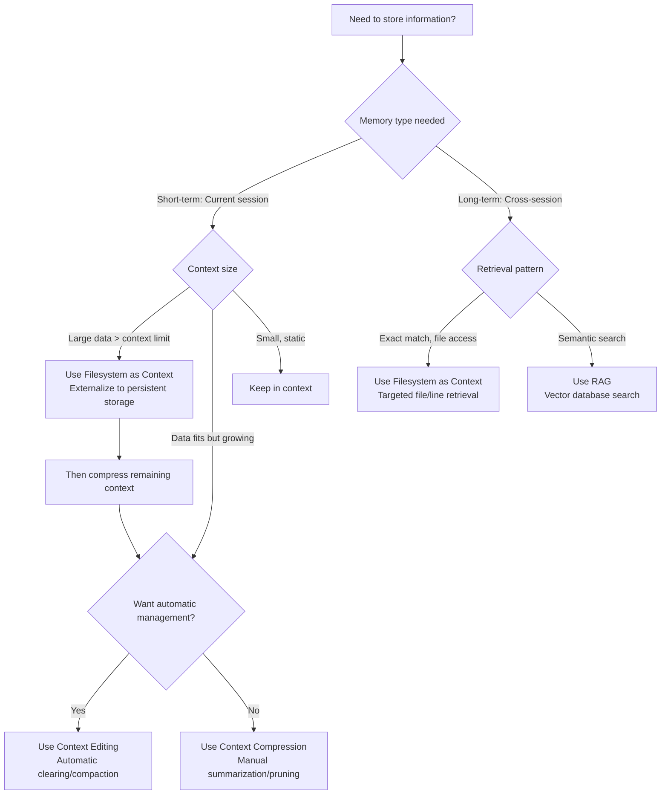

# Memory Management

## Introduction

Memory is what transforms agents from stateless responders into intelligent systems capable of learning, adapting, and maintaining context across interactions. Without memory, agents cannot remember past conversations, learn from experience, or build upon previous work. Effective memory management is one of the most critical aspects of building production-ready agentic systems.

This chapter provides an overview of memory management strategies for agentic systems. We'll explore the different types of memory, the distinction between short-term and long-term memory, and the techniques used to extend memory beyond immediate context through persistent storage. For specific implementation patterns, see the pattern modules referenced throughout this chapter.

## The Two Types of Agent Memory

Agent memory can be broadly categorized into two types, each serving different purposes:

### Short-Term Memory (Contextual Memory)

Short-term memory exists within the LLM's context window—the immediate working memory that contains recent messages, agent replies, tool usage results, and agent reflections from the current interaction.

**Characteristics:**
- **Limited Capacity:** Context windows have hard limits (typically 32K to 1M+ tokens depending on the model)
- **High Attention:** Information in the context window receives full model attention
- **Ephemeral:** Lost once the session concludes unless explicitly saved
- **Costly:** Processing large contexts consumes tokens and increases latency

**Challenges:**
- **Token Limits:** Exceeding context limits causes errors or truncation
- **Attention Decay:** Information at the beginning of long contexts may receive less attention ("Lost in the Middle" problem)
- **Cost:** Large contexts are expensive to process repeatedly
- **KV-Cache Efficiency:** Changing prompt prefixes invalidates Key-Value caches, dramatically increasing latency

### Long-Term Memory (Persistent Memory)

Long-term memory acts as a repository for information agents need to retain across interactions, tasks, or extended periods. Data is stored outside the agent's immediate processing environment, typically in databases, knowledge graphs, or vector databases.

**Characteristics:**
- **Unlimited Capacity:** Can store vast amounts of information
- **Persistent:** Survives across sessions and interactions
- **Query-Based:** Information is retrieved on-demand rather than always present
- **Specialized Storage:** Different storage types optimized for different access patterns

**Challenges:**
- **Retrieval Overhead:** Querying external memory adds latency
- **Relevance:** Must retrieve the right information at the right time
- **Consistency:** Managing updates and ensuring data consistency
- **Integration:** Seamlessly integrating retrieved information into context

## Relationship to Context Patterns

Memory Management is a **conceptual overview** that describes the architecture of agent memory. Understanding how it relates to implementation patterns helps clarify when to use which approach.

### Memory Management (Concept) vs Context Compression (Pattern)

**Memory Management** is the **conceptual framework** that describes:
- **What:** Two types of memory (short-term/context vs long-term/persistent)
- **Why:** The need for different memory types and their trade-offs
- **Overview:** High-level strategies for managing memory

**Context Compression** and **Context Editing** are **implementation patterns** that provide:
- **How:** Concrete techniques for managing short-term memory (context window)
- **Specific methods:** Externalization, summarization, pruning, automatic clearing
- **Practical guidance:** When and how to apply compression techniques

**Relationship:** Memory Management explains the "what" and "why" of memory architecture, while Context Compression/Editing provide the "how" for managing short-term memory.

### Short-Term Memory Management

Short-term memory (context window) is managed through:
- **Context Compression:** Umbrella strategy including externalization, summarization, pruning, attention manipulation
- **Context Editing:** Automatic technique for managing context size (server-side clearing, client-side compaction)
- **Filesystem as Context:** Primary externalization technique for offloading large data

These patterns work together: Filesystem as Context externalizes large data, Context Compression provides the overall strategy, and Context Editing provides automatic management.

### Long-Term Memory Implementation

Long-term memory (persistent storage) is implemented through:
- **Filesystem as Context:** For targeted retrieval of specific files, line ranges, or structured data
- **Knowledge Retrieval (RAG):** For semantic search over large knowledge bases using vector databases

**When to use Filesystem as Context:** Exact file retrieval, line-range reads, structured data access
**When to use RAG:** Semantic search, similarity matching, large knowledge bases

## Pattern Selection Guide

Use the following flowchart to determine which memory strategy to use:

## Key Memory Management Challenges

### The Persistence Challenge

The most fundamental challenge in memory management is ensuring agents can retain and access information across time, sessions, and tasks. Agents must:

1. **Persist Information:** Save important data beyond the current session
2. **Retrieve Efficiently:** Access stored information quickly when needed
3. **Maintain Relevance:** Keep stored information accurate and up-to-date
4. **Scale Storage:** Handle large amounts of data that exceed context limits

### The "Lost in the Middle" Problem

Research shows that LLMs have reduced attention to information in the middle of long contexts. Important information placed at the beginning or end receives more attention than information in the middle. This creates challenges for:

- **Long Conversations:** Critical early context may be "lost" as conversations extend
- **Complex Plans:** High-level goals defined early may be forgotten during execution
- **Multi-Step Tasks:** Intermediate results may be forgotten in later steps

Memory patterns like Recitation address this by maintaining persistent plans that are actively brought back into context.

### Storage and Retrieval Optimization

Memory management directly impacts performance and capability:

- **Storage Efficiency:** External memory enables handling datasets far exceeding context limits
- **Retrieval Overhead:** Querying external memory adds latency but enables unlimited scale
- **Just-in-Time Access:** Retrieve only what's needed when needed, keeping context focused

## Memory Management Strategies

### External Memory Systems

For data too large for context windows, external memory systems use an **Offload/Query protocol**:

1. **Offload:** Save raw content to disk or database
2. **Pointer:** Place only a reference in context (e.g., "Content saved to /data/doc1.txt")
3. **Read on Demand:** Agent queries external memory via specialized tools when needed

This pattern, detailed in the **Pattern: Filesystem as Context** module, enables agents to handle datasets far exceeding context limits.

### Persistent Planning and Recitation

For long-horizon tasks, agents need to maintain awareness of their high-level goals and overall progress. This is achieved through persistent planning:

- **Persistent Plan Files:** Maintaining plans in external storage (like `todo.md`) that survive across steps
- **Active Recitation:** Reading plans back into context at each step to maintain goal alignment
- **Progress Tracking:** Updating plans as tasks are completed while preserving overall objectives

The Recitation Pattern addresses the "Lost in the Middle" problem by maintaining persistent plan files that agents read at every step. This brings high-level goals from the distant past to the immediate present, ensuring agents remain focused on macro-objectives while executing micro-tasks.

This pattern is covered in detail in the **Pattern: Persistent Task List (Recitation)** module.

## Memory in Different Frameworks

Different frameworks provide different memory management capabilities:

**Google ADK:**
- **Session Service:** Manages conversation history and temporary state
- **Memory Service:** Provides long-term, searchable knowledge storage
- **State Management:** Structured ways to maintain conversation history

**LangChain:**
- **Memory Classes:** Various memory types (Buffer, Summary, etc.)
- **Conversation Chains:** Built-in memory management for conversational agents
- **Vector Stores:** Integration with RAG systems for long-term memory

**LangGraph:**
- **State Management:** Typed state objects that persist across steps
- **Message History:** Append-only message structures optimized for caching

## Choosing Memory Strategies

The choice of memory strategy depends on several factors:

**Data Volume:** Small data fits in context; large data requires external memory

**Persistence Requirements:** Session-only data uses State management; cross-session data requires MemoryService, databases, or filesystem storage

**Query Patterns:** Exact matches work with filesystem storage; semantic queries require vector databases (RAG)

**Access Patterns:** Frequently accessed data benefits from faster storage; archival data can use slower, cheaper storage

**Retrieval Needs:** Targeted retrieval (specific files, line ranges) works with filesystem tools; semantic search requires vector databases

## Integration with Other Capabilities

Memory management integrates with other agent capabilities:

- **Reasoning Techniques:** Memory provides context for reasoning and planning
- **Tool Use:** External memory is accessed via specialized tools
- **Knowledge Retrieval (RAG):** RAG systems provide long-term memory through vector databases
- **Goal Setting and Monitoring:** Memory stores goals and tracks progress across sessions
- **Planning:** Memory maintains plans and tracks execution progress

## Key Insights

1. **Memory is not optional:** Agents operating over time or handling complex tasks require sophisticated memory management. Without it, they cannot learn, adapt, or maintain context across interactions.

2. **External memory enables scale:** The Offload/Query pattern allows agents to handle datasets far exceeding context limits, essential for production systems. The filesystem acts as unlimited persistent storage.

3. **Restorable compression is key:** When offloading data to external memory, always maintain references (paths, URLs, keys) that enable precise retrieval when needed. This enables just-in-time access.

4. **The Recitation Pattern prevents goal drift:** Maintaining persistent plans that are actively read at every step ensures agents stay focused on high-level objectives in long-horizon tasks, addressing the "lost in the middle" problem.

5. **Memory types serve different purposes:** Short-term memory (context) is for immediate working memory; long-term memory (external storage) is for persistence and scale. Both are essential for production systems.

## Next Steps

This chapter provided an overview of memory management concepts focused on persistence and external storage. For detailed implementation guidance, see:

- **Pattern: Persistent Task List (Recitation)** - Maintaining persistent plans to prevent goal drift in long-horizon tasks
- **Pattern: Filesystem as Context** - Offloading and retrieving large data using external persistent storage
- **Pattern: Knowledge Retrieval (RAG)** - Using vector databases for semantic long-term memory and search

For techniques related to managing the finite context window itself (compression, editing, optimization), see the **Context** part which covers strategies for optimizing what goes into the context window.

Effective memory management is essential for building production-ready agentic systems. Understanding these concepts and patterns will enable you to build agents that can operate effectively over time, retain information across sessions, and handle complex, long-horizon tasks.
