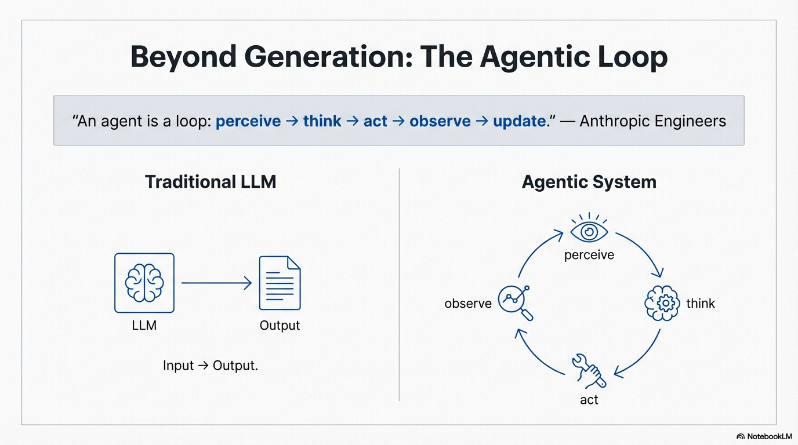
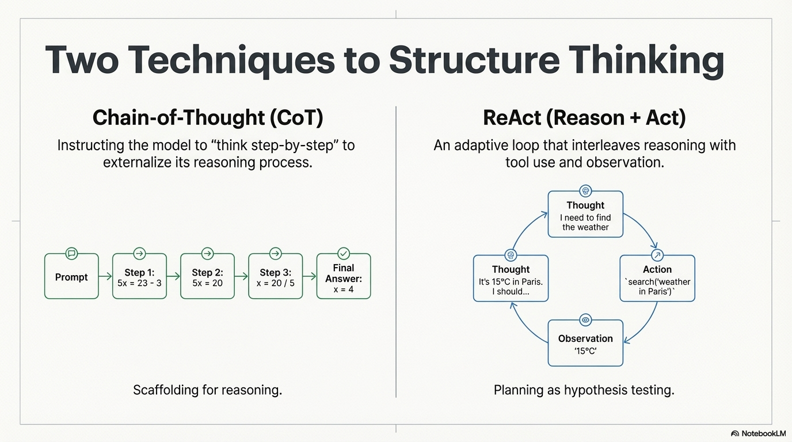

# Reasoning Techniques

## Introduction

Reasoning is the foundational capability that distinguishes agentic systems from simple content generators. 
While traditional LLMs produce text based on patterns learned during training, agentic systems must **think** before they act—simulating problem-solving internally, evaluating options, and making strategic decisions to achieve goals.
This chapter provides an overview of reasoning techniques used in agentic systems. 
We'll explore how agents structure their thought processes, the different approaches available, and when each technique is most appropriate. 
For detailed implementation patterns, see the specific pattern modules referenced throughout this chapter.

> **"An agent is a loop: perceive → think → act → observe → update."** — Anthropic Engineers




## The Importance of Reasoning in Agentic Systems

The quality of an agent's reasoning directly determines its success. 
A flawed thought process leads to failed actions, wasted resources, and costly error loops. 
Effective reasoning enables agents to:

- **Improve Accuracy:** Explicit step-by-step reasoning significantly reduces errors and hallucinations, particularly in mathematical, logical, or multi-step tasks
- **Enable Transparency:** By documenting their thought process, agents provide visibility into decision-making, essential for debugging and building user trust
- **Support Error Correction:** Structured reasoning allows agents to analyze failures, understand what went wrong, and adapt their approach
- **Enable Strategic Planning:** Advanced reasoning techniques allow agents to explore multiple paths before committing to a solution


## Core Reasoning Approaches

Agentic systems employ several reasoning techniques, each suited to different problem types and complexity levels:



### Chain-of-Thought (CoT)

Chain-of-Thought is the simplest and most widely adopted reasoning technique. 
It works by explicitly instructing the model to generate intermediate reasoning steps before producing a final answer.

> **"Chain-of-thought is not reasoning — it is scaffolding for reasoning."** — Anthropic

The agent is prompted to "think step-by-step" or show its work. 
This forces the model to allocate tokens to reasoning, which significantly improves accuracy on complex problems.
CoT is ideal for tasks requiring explicit step-by-step thinking, such as mathematical problems, logical deductions, or multi-step calculations. 
It's simple to implement and adds minimal overhead.

**Example scenario:** An agent solving "If 5x + 3 = 23, what is x?" would show:
```
Thought: I need to solve for x. First, I'll subtract 3 from both sides: 5x = 20. Then divide by 5: x = 4.
Answer: x = 4
```

### ReAct (Reason + Act)

ReAct is the foundational pattern for adaptive, tool-using agents. 
It creates a self-correcting loop that intertwines reasoning, action, and observation.

> **"ReAct is planning as hypothesis testing."** — OpenAI Researchers

**How it works:** The agent cycles through three phases:

1. **Thought:** The agent reasons about the current state, available tools, and next action
2. **Action:** The agent generates structured code/JSON to call a tool
3. **Observation:** The system executes the action and returns results
4. **Loop:** The agent returns to Thought, incorporating new observations

This creates adaptive behavior where errors in tool execution are analyzed and corrected in subsequent thoughts.
ReAct is essential for any agent that needs to interact with tools, adapt to changing conditions, or correct errors autonomously. It's the core loop for most agentic systems.

**Example scenario:** An agent tasked with "Find the weather in Paris and London" would:
```
Thought: I need weather data for two cities. I'll use the weather API.
Action: get_weather("Paris")
Observation: Paris: 15°C, cloudy
Thought: Now I need London's weather.
Action: get_weather("London")
Observation: London: 12°C, rainy
Thought: I have both pieces of information. I can provide the answer.
Action: FINAL_ANSWER
```

### Tree-of-Thoughts (ToT)

Tree-of-Thoughts is an advanced technique that explores multiple potential solution paths before committing to one. 
It's computationally expensive but essential for high-stakes problems.
At decision points, the agent generates multiple thought branches. 
Each branch is evaluated using heuristics (often another LLM call) that score likelihood of success. 
Lower-scoring branches are pruned, and the agent commits to the optimal path.
ToT is valuable for strategic problems where exploring multiple approaches significantly improves outcomes, such as complex planning, architecture design, or high-stakes decision-making. 
The cost is justified when the value of finding the optimal solution outweighs the computational expense.

**Example scenario:** An agent designing a system architecture might:
1. Generate three different architectural approaches
2. Evaluate each for scalability, cost, and complexity
3. Prune the lowest-scoring approach
4. Deepen reasoning on the remaining two
5. Select the optimal path

### Self-Consistency

Self-Consistency improves accuracy by generating multiple independent reasoning chains and using voting to select the most frequent answer.
The agent generates several independent solutions to the same problem, then selects the answer that appears most frequently across all chains.
Unlike Tree-of-Thoughts, which evaluates and prunes different solution paths before committing, Self-Consistency generates multiple independent solutions without evaluation and uses statistical voting to select the consensus answer.
Self-Consistency is useful when accuracy is critical and the computational cost of multiple reasoning chains is acceptable. It's particularly effective for problems with clear right/wrong answers.

## The Reasoning Process in Practice

Effective reasoning in agentic systems relies on disciplined state management. 
The agent must:

1. **Read Current State:** Access the latest user message, current plan, and recent observations
2. **Generate Thoughts:** Use reasoning to determine the next action based on available information
3. **Execute Actions:** Call tools or provide answers based on reasoning
4. **Update State:** Incorporate new observations for the next reasoning cycle

This process requires careful orchestration of context, memory, and tool execution. 

## Choosing the Right Reasoning Technique

The choice of reasoning technique depends on several factors:

**Problem Complexity:** Simple problems may not need explicit reasoning, while complex multi-step problems benefit significantly from structured thinking.

**Transparency Requirements:** If you need to understand or debug the agent's decision-making, explicit reasoning (CoT, ReAct) is essential.

**Cost Constraints:** Reasoning increases token usage and latency. Balance the benefits of explicit reasoning against performance requirements.

**Error Correction Needs:** If the agent must adapt to failures or changing conditions, ReAct's observation-analysis cycle is crucial.

**Strategic Importance:** For high-stakes decisions where exploring multiple paths is valuable, Tree-of-Thoughts may be justified despite higher costs.

## Integration with Other Capabilities

Reasoning techniques work in conjunction with other agent capabilities:

- **Tool Use:** Reasoning determines which tools to use and how to use them effectively
- **Planning:** Reasoning techniques are used to generate, evaluate, and refine plans
- **Memory Management:** Reasoning utilizes memory (context, state, external) to make informed decisions
- **Reflection:** Reasoning can be evaluated and refined through reflection patterns
- **Goal Setting:** Reasoning works towards achieving set goals, using goal information to guide decisions

## Key Takeaways

- Unlike simple text generation, agents operating in dynamic environments require explicit reasoning to make decisions, use tools, and adapt to changing conditions.
- Users and developers need visibility into agent reasoning to trust and debug agentic systems. Explicit reasoning provides this transparency.
- More sophisticated reasoning techniques (ToT, Self-Consistency) improve accuracy but increase computational cost. Choose based on problem requirements.
- The ability to reason about observations allows agents to correct errors and adapt to changing conditions autonomously.
- Effective reasoning requires careful management of context, observations, and plans. Poor state management undermines even sophisticated reasoning techniques.