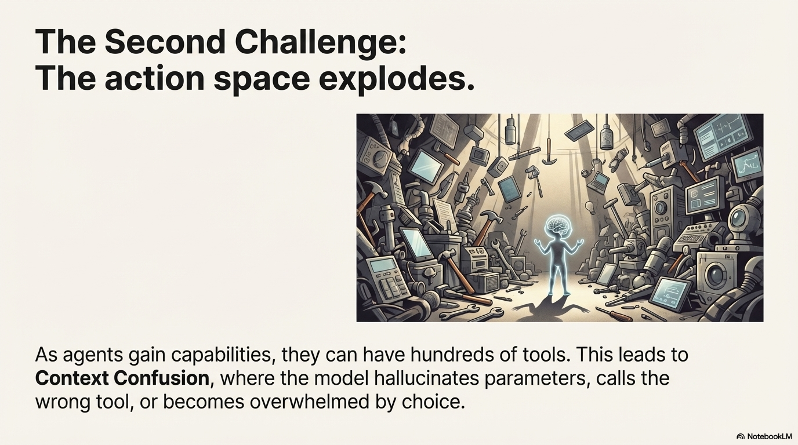
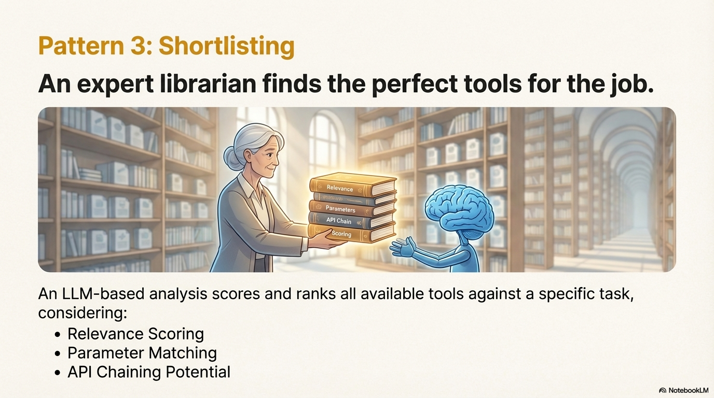

# Pattern: Shortlisting

## Motivation

A librarian faces thousands of books in a catalog and must find the most relevant ones for a researcher's query. 
They don't read every book—they analyze titles, descriptions, and keywords to create a shortlist of candidates. Similarly, agents often have access to hundreds or thousands of tools, APIs, or functions, but they can't include all of them in their context window. 
The challenge is: how do you identify the most relevant tools from a large catalog without overwhelming the agent's context or wasting computational resources?
Consider an agent that needs to interact with a large API catalog:

- A digital sales platform with 200+ API endpoints
- An OpenAPI specification with 50+ operations
- A Model Context Protocol (MCP) server with 30+ tools
- A codebase with hundreds of available functions
Including all available tools in every prompt would be expensive, slow, and confusing for the agent. 
The agent needs a way to intelligently filter and rank tools based on the specific task at hand, identifying not just relevant tools, but also understanding how they can work together in multi-step workflows.



## Pattern Overview

### Problem

As agentic systems scale, they increasingly interact with large tool catalogs—OpenAPI specifications, MCP servers, codebases with many functions, or multi-agent systems with specialized capabilities. Agents often have access to hundreds or thousands of tools, APIs, or functions, but cannot include all of them in their context window. Without shortlisting, agents face a fundamental tension: include too many tools and waste tokens while confusing the model, or include too few and risk missing critical capabilities. When context window constraints make including all tools impractical, agents need a way to intelligently filter and rank tools based on the specific task at hand.

### Solution

The Shortlisting Pattern enables agents to analyze a large set of available tools, APIs, or functions and select the most relevant subset based on a task description. It uses LLM-based analysis to score and rank candidates, considering direct relevance, parameter matching, and potential for tool chaining in multi-step workflows. Shortlisting resolves the tension by providing an intelligent, task-aware filtering mechanism that identifies not just individual relevant tools, but also understands how tools can be chained together in workflows.

The pattern reduces context window usage by filtering to relevant tools, improves decision-making by focusing the agent's attention, and enables discovery of tool chains that work together to accomplish complex goals. This approach ensures that agents can work with large tool catalogs efficiently, identifying the most relevant capabilities for each specific task without overwhelming the context window or missing critical capabilities.

!!! note "What is MCP (Model Context Protocol)?"
    The **Model Context Protocol (MCP)** is an open standard developed by Anthropic for connecting AI applications to external tools and data sources. 
    MCP provides a standardized way for AI agents to discover, access, and interact with tools across different servers and services.
    
    **Key features:**
    
    - **Standardized Interface:** MCP defines a common protocol for exposing tools, resources, and prompts, making it easy to integrate diverse capabilities into AI agents.
    - **Tool Discovery:** MCP servers expose tool definitions that agents can query and use, enabling dynamic tool discovery at runtime.
    - **Multi-Server Architecture:** Agents can connect to multiple MCP servers simultaneously, each providing different sets of tools (e.g., database access, file system operations, API integrations).
    - **Resource Access:** Beyond tools, MCP servers can expose resources (like documents, databases) and templates that agents can access.
    - **Extensibility:** Developers can create custom MCP servers to expose any capabilities—from custom APIs to domain-specific tools.
    
    **Why it matters for shortlisting:**
    
    - When an agent connects to multiple MCP servers, the total number of available tools can quickly exceed 100+, making tool discovery and selection a critical challenge.
    - Shortlisting becomes essential to filter through tools from multiple MCP servers and identify which ones are relevant for a specific task.
    - Without shortlisting, agents would need to include tool definitions from all MCP servers in every prompt, consuming significant context and potentially confusing the model.


### Key Concepts

- **Relevance Scoring:** LLM-based analysis that evaluates each tool/API against the task description and assigns a relevance score (typically 0.0-1.0), enabling ranking and filtering.
- **Parameter Matching:** Evaluating whether required parameters for a tool can be satisfied—either from direct user input or from the output of other tools in a potential chain.
- **API/Tool Chaining:** Identifying how multiple tools can work together in sequence, where one tool's output provides input parameters for subsequent tools, enabling multi-step workflows.
- **Schema Matching:** Understanding input/output schemas to determine chaining potential—analyzing whether one tool's response structure matches another tool's required parameters.
- **Structured Output:** Returning a ranked list with scores and reasoning for each selected tool, enabling transparency, debugging, and integration with downstream planning agents.

### How It Works

The Shortlisting Pattern operates through a structured process that integrates seamlessly into agent workflows:

1. **Trigger & Context Setup:** The shortlisting agent is triggered by a planning agent when it determines that API discovery is needed. The agent receives:

   - A task description (often enriched with context from the current sub-task)
   - A filtered catalog of available tools/APIs for a specific application
   - Application context (app name, description)
   - Optional memory tips from past successful shortlisting experiences

2. **LLM-Based Analysis:** An LLM analyzes each tool against the task using a sophisticated prompt that emphasizes:

   - **Direct functional match:** Does the tool's purpose align with the task?
   - **Parameter availability:** Can required parameters be satisfied from:
   
        - Direct user input (explicitly mentioned in the query)
        - Output from other APIs (enabling chaining)
        - **Critical constraint:** Do NOT assume missing parameters unless they can be realistically obtained from another API's output
   - **Chaining potential:** Can this tool's output provide input parameters for other relevant tools?
   - **Schema compatibility:** Do response schemas match input requirements for chaining? (e.g., API A returns `id: integer`, API B requires `petId: integer`)
   - **Workflow position:** Is this tool for initial data gathering, intermediate processing, or final action?

3. **Relevance Scoring:** Each tool receives a relevance score (0.0-1.0) with detailed reasoning that explains:

   - Why it was selected
   - How its required parameters can be satisfied
   - Its role in potential multi-step workflows
   - Its compatibility with other shortlisted APIs for chaining

4. **Ranked Shortlist:** The agent returns a ranked list of relevant tools, ordered by relevance score (highest first), with:

   - At least 1 API (enforced minimum)
   - Detailed reasoning for each selection
   - Step-by-step thoughts explaining the analysis process

5. **Post-Processing & State Management:** The shortlist is processed to:

   - Filter the full API catalog to only include shortlisted APIs
   - Build structured output summaries with app names, API names, descriptions, and reasoning
   - Store results in agent state history for future reference
   - Track the step for activity logging and debugging

6. **Integration with Planning:** The shortlist feeds back into the planning agent, which:

   - Uses the filtered API set for subsequent planning decisions
   - Can trigger additional shortlisting if new APIs are needed
   - Passes shortlisted APIs to code generation agents for execution



## When to Use This Pattern

### ✅ Use this pattern when:

- **Large tool/API catalogs:** You have 20+ tools/APIs and including all of them in context is impractical or expensive.
- **Multi-step workflows:** Tasks require chaining multiple tools together, and you need to identify which tools can work in sequence.
- **Context window constraints:** Including all available tools would consume too many tokens or exceed context limits.
- **Dynamic tool discovery:** Tools are discovered at runtime (e.g., from OpenAPI specs, MCP servers) and need filtering before use.
- **Cost optimization:** Reducing the number of tools in context saves on token costs for each agent interaction.
- **Specialized tool selection:** Different tasks require different subsets of tools, and manual filtering is impractical.

### ❌ Avoid this pattern when:

- **Small tool sets:** You have fewer than 10-15 tools, and including all of them is feasible and cost-effective.
- **Simple single-tool tasks:** The task clearly requires one specific tool, and there's no ambiguity.
- **Real-time constraints:** The latency of LLM-based shortlisting (typically 1-3 seconds) is unacceptable for the use case.
- **Fixed tool sets:** The same tools are always used together, making shortlisting unnecessary overhead.
- **Tool availability is dynamic:** Tools appear/disappear frequently, making pre-shortlisting ineffective.

### Decision Guidelines

Use Shortlisting when the benefits of intelligent filtering outweigh the added latency and cost. 
Consider catalog size: catalogs with 20+ tools benefit significantly from shortlisting. 
Consider task variability: if different tasks require different tool subsets, shortlisting provides value. 
Consider context constraints: if including all tools would exceed context limits or be prohibitively expensive, shortlisting is essential. 
However, if you have a small, fixed set of tools that are always used together, the overhead of shortlisting may not be justified.

## Practical Applications & Use Cases

The Shortlisting Pattern is essential for building scalable agentic systems that interact with large tool ecosystems:

### API Discovery in Large Catalogs

**Scenario:** An agent needs to interact with a digital sales platform that exposes 200+ REST API endpoints through an OpenAPI specification.

**Challenge:** Including all 200+ API definitions in every prompt would consume thousands of tokens and confuse the agent. The agent needs to identify which APIs are relevant for specific tasks like "get the top account by revenue" or "update a customer's contact information."

**Solution:** Shortlisting analyzes the task description against all available APIs, scoring each for relevance. For "get top account by revenue," it might shortlist:

- `get_accounts` (relevance: 0.95) - retrieves all accounts with revenue data, no parameters required
- `get_accounts_alt` (relevance: 0.80) - alternative account retrieval method
- `get_account_by_id` (relevance: 0.60) - useful for getting details after identifying top account, can chain with first API's output

**Real-World Flow:**

1. User query: "get top account by revenue"
2. Planning agent determines shortlisting is needed
3. Shortlister receives task and all 200+ available APIs
4. Shortlister analyzes and returns 2-3 relevant APIs with scores
5. Filtered API set (only 2-3 APIs) is passed to code generation agent
6. Code generation uses only shortlisted APIs, saving ~95% of context tokens

The agent then uses only these shortlisted APIs in subsequent planning and execution, dramatically reducing context usage from thousands of tokens to hundreds.

### Tool Selection in Multi-Agent Systems

**Scenario:** An orchestrator agent coordinates multiple specialized worker agents, each with different tool sets. The orchestrator needs to select which workers and tools to use for a given task.

**Challenge:** The orchestrator has access to 50+ tools across 10 different worker agents. It needs to identify which subset of workers and their tools are relevant for the current task.

**Solution:** Shortlisting evaluates tools across all workers, identifying relevant capabilities. The orchestrator then routes the task to workers whose tools were shortlisted, enabling efficient multi-agent coordination.

### Code Generation with Function Selection

**Scenario:** A coding agent has access to a codebase with hundreds of utility functions. When generating code to solve a problem, it needs to identify which functions are relevant.

**Challenge:** Including all function signatures in the prompt would be impractical. The agent needs to identify relevant functions based on the coding task.

**Solution:** Shortlisting analyzes the coding task description and available function signatures, shortlisting relevant functions. The agent then generates code using only the shortlisted functions, improving code quality and reducing context usage.

### MCP Server Tool Discovery

**Scenario:** An agent interacts with multiple Model Context Protocol (MCP) servers, each exposing 10-30 tools. The agent needs to discover and select relevant tools for a task.

**Challenge:** With multiple MCP servers, the total tool count can exceed 100+. The agent needs an efficient way to identify relevant tools without querying all servers for every task.

**Solution:** Shortlisting evaluates tools from all available MCP servers against the task, creating a unified shortlist of relevant tools across servers. This enables efficient tool discovery in distributed tool ecosystems.

## Implementation

### Core Architecture

The Shortlisting Pattern consists of three main components: the Shortlister Agent, the Tool Catalog, and the Output Schema.

The core agent that performs the analysis:

??? "Shortlister Agent"

    ```python
    from typing import List, Optional
    from pydantic import BaseModel, Field

    class ToolDetails(BaseModel):
        """Details for a shortlisted tool."""
        name: str
        relevance_score: float = Field(ge=0.0, le=1.0)
        reasoning: str

    class ShortlistOutput(BaseModel):
        """Output from the shortlisting agent."""
        thoughts: List[str]
        result: List[ToolDetails]  # Ranked by relevance_score

    class ShortlisterAgent:
        """Agent that shortlists relevant tools for a given task."""
        
        def __init__(self, llm, prompt_template):
            self.llm = llm
            self.prompt_template = prompt_template
        
        async def shortlist(
            self, 
            task: str, 
            available_tools: List[dict],
            memory_tips: Optional[str] = None
        ) -> ShortlistOutput:
            """Shortlist relevant tools for a task."""
            # Format tools for analysis
            tools_json = json.dumps(available_tools, indent=2)
            
            # Invoke LLM with structured output
            messages = self.prompt_template.format_messages(
                task=task,
                available_tools=tools_json,
                memory=memory_tips or ""
            )
            
            response = await self.llm.ainvoke(messages)
            return ShortlistOutput.model_validate_json(response.content)
        
        @staticmethod
        def filter_tools(all_tools: dict, shortlisted_names: List[str]) -> dict:
            """Filter tool catalog to only include shortlisted tools."""
            return {
                app: {tid: tool for tid, tool in tools.items() 
                    if tool.get("name") in shortlisted_names}
                for app, tools in all_tools.items()
            }
    ```

**Key Design Decisions:**

- **Structured Output:** Pydantic models ensure consistent, parseable results
- **Relevance Scoring:** 0.0-1.0 scale enables ranking and filtering
- **Reasoning Field:** Enables transparency and downstream agent understanding
- **Memory Integration:** Optional past experiences improve accuracy over time
- **Filtering:** Reduces large catalogs to only shortlisted entries, saving context

#### Prompt Design

The system prompt is critical for effective shortlisting. The actual implementation uses a sophisticated prompt with few-shot examples and explicit constraints:

**System Prompt Structure:**

```python
SYSTEM_PROMPT = """You are an expert at selecting relevant tools/APIs to fulfill a user's request.

Analyze the available tools and user query, then return a ranked list of relevant tools.

**Key Evaluation Criteria:**
1. **Direct Match:** How well does the tool's purpose match the task?
2. **Parameter Availability:** Can required parameters be sourced from:
   - Direct user input (explicitly mentioned)
   - Output from other tools (enabling chaining)
   - Do NOT assume missing parameters unless obtainable from another tool
3. **Chaining Potential:** Can this tool's output provide inputs for other relevant tools?
4. **Schema Compatibility:** Do response schemas match input requirements for chaining?
5. **Workflow Position:** Is this for initial data gathering, processing, or final action?

**Output Requirements:**
- Return at least 1 tool (enforced minimum)
- Rank by relevance_score (0.0-1.0, highest first)
- Provide detailed reasoning for each selection
- Explain parameter sources and chaining potential


{{memory}}

"""
```

**User Prompt Template:**

```python
USER_PROMPT = """Task: {{task}}

Available Tools:
{{available_tools}}
"""
```

**Key Prompt Features:**

- **Enforced Minimum:** Requires at least 1 tool (prevents empty shortlists)
- **Few-Shot Examples:** Include examples showing tool chaining scenarios
- **Explicit Constraints:** Clear rules about parameter sourcing
- **Memory Integration:** Optional memory tips for learning from past experiences
- **Schema Awareness:** Emphasizes understanding response schemas for chaining
- **Workflow Position:** Considers where tools fit in multi-step workflows

#### Integration with Agent Workflow

Shortlisting integrates into agent workflows through a node-based architecture:

??? "Workflow Integration Pattern"

    ```python
    from typing import TypedDict, Optional, Literal

    class AgentState(TypedDict):
        """State managed across the agent workflow."""
        task: str
        available_tools: dict  # Full tool catalog
        shortlisted_tools: Optional[List[ToolDetails]]
        history: List[dict]

    async def shortlist_node(state: AgentState) -> AgentState:
        """Shortlisting node in the workflow."""
        shortlister = ShortlisterAgent(llm, prompt_template)
        
        # Execute shortlisting
        result = await shortlister.shortlist(
            task=state["task"],
            available_tools=list(state["available_tools"].values())
        )
        
        # Filter catalog to only shortlisted tools
        shortlisted_names = [t.name for t in result.result]
        filtered_tools = ShortlisterAgent.filter_tools(
            state["available_tools"], 
            shortlisted_names
        )
        
        # Update state
        return {
            **state,
            "shortlisted_tools": result.result,
            "available_tools": filtered_tools,  # Reduced catalog
            "history": state["history"] + [{"action": "shortlist", "result": result}]
        }

    async def planner_node(state: AgentState) -> AgentState:
        """Planning agent decides when to shortlist."""
        # Planning logic determines if shortlisting is needed
        if needs_shortlisting(state):
            return {"next": "shortlist"}
        else:
            return {"next": "execute"}

    # Build workflow graph
    graph = StateGraph(AgentState)
    graph.add_node("planner", planner_node)
    graph.add_node("shortlist", shortlist_node)
    graph.add_node("execute", execute_node)

    # Conditional routing
    graph.add_conditional_edges(
        "planner",
        lambda s: s.get("next", "execute"),
        {"shortlist": "shortlist", "execute": "execute"}
    )
    graph.add_edge("shortlist", "planner")  # Return to planner
    ```

**Key Integration Points:**
- **State Management:** Shortlisted tools are stored and filtered from the full catalog
- **History Tracking:** Results stored for reflection and debugging
- **Conditional Routing:** Planning agent decides when shortlisting is needed
- **Iterative Process:** Shortlisting can be triggered multiple times as tasks evolve

??? "Basic Example"

    ```python
    from pydantic import BaseModel, Field
    import json

    # Define output schema
    class ToolDetails(BaseModel):
        name: str
        relevance_score: float = Field(ge=0.0, le=1.0)
        reasoning: str

    class ShortlistOutput(BaseModel):
        thoughts: list[str]
        result: list[ToolDetails]

    # Available tools
    available_tools = [
        {
            "name": "get_accounts",
            "description": "Retrieve all accounts with revenue data",
            "parameters": [],
            "response_schema": {
                "type": "array",
                "items": {"properties": {"id": "string", "revenue": "number"}}
            }
        },
        {
            "name": "get_account_by_id",
            "description": "Get account details by ID",
            "parameters": [{"name": "account_id", "required": True}],
            "response_schema": {"properties": {"id": "string", "revenue": "number"}}
        }
    ]

    # Shortlist for a task
    task = "Get the top account by revenue"
    # Mock implementation for demonstration
    from langchain_google_genai import ChatGoogleGenerativeAI
    from langchain_core.prompts import ChatPromptTemplate
    from langchain_core.output_parsers import JsonOutputParser

    llm = ChatGoogleGenerativeAI(model="gemini-2.0-flash", temperature=0)

    # Simplified shortlisting example
    async def shortlist_tools(task: str, tools: list) -> ShortlistOutput:
        prompt = ChatPromptTemplate.from_template(
            "Select relevant tools for: {task}
    Tools: {tools}
    Return JSON with tool names and scores."
        )
        chain = prompt | llm | JsonOutputParser()
        result = chain.invoke({"task": task, "tools": str(tools)})
        # Mock result for demonstration
        return ShortlistOutput(
            thoughts=["get_accounts needed to retrieve all accounts"],
            result=[
                ToolDetails(name="get_accounts", relevance_score=0.9, reasoning="Retrieves all accounts with revenue"),
                ToolDetails(name="get_account_by_id", relevance_score=0.7, reasoning="Can get specific account after filtering")
            ]
        )

    # Example usage
    import asyncio
    async def main():
        result = await shortlist_tools(task, available_tools)
        for tool in result.result:
            print(f"{tool.name}: {tool.relevance_score:.2f} - {tool.reasoning}")

    if __name__ == "__main__":
        asyncio.run(main())
    ```

    **Expected Output:**
    ```
    get_accounts: 0.95 - Directly fulfills task, no parameters needed, includes revenue data
    get_account_by_id: 0.60 - Useful after identification, can chain with get_accounts output
    ```

The example below demonstrates how shortlisting identifies tools that can be chained together:

??? "Advanced Example: Tool Chaining"

    ```python
    available_tools = [
        {
            "name": "search_products",
            "description": "Search products by keyword",
            "parameters": [{"name": "keyword", "required": True}],
            "response_schema": {
                "items": {"properties": {"product_id": "string", "price": "number"}}
            }
        },
        {
            "name": "add_to_cart",
            "description": "Add product to cart",
            "parameters": [
                {"name": "product_id", "required": True},
                {"name": "quantity", "required": True}
            ]
        }
    ]

    task = "Find products matching 'laptop' and add the cheapest one to my cart"

    # Mock shortlisting example
    from pydantic import BaseModel, Field
    from typing import List

    class ToolDetails(BaseModel):
        name: str
        relevance_score: float = Field(ge=0.0, le=1.0)
        reasoning: str

    class ShortlistOutput(BaseModel):
        thoughts: List[str]
        result: List[ToolDetails]

    async def shortlist_tools(task: str, tools: list) -> ShortlistOutput:
        """Mock shortlisting function."""
        # In real implementation, this would use LLM
        return ShortlistOutput(
            thoughts=["Need to search first, then add to cart"],
            result=[
                ToolDetails(
                    name="search_products",
                    relevance_score=0.95,
                    reasoning="Required to find products matching 'laptop'"
                ),
                ToolDetails(
                    name="add_to_cart",
                    relevance_score=0.85,
                    reasoning="Needed to add cheapest product to cart after search"
                )
            ]
        )

    import asyncio

    async def main():
        result = await shortlist_tools(task, available_tools)
        for tool in result.result:
            print(f"{tool.name}: {tool.relevance_score:.2f} - {tool.reasoning}")

    if __name__ == "__main__":
        asyncio.run(main())
    ```

Shortlisting can be improved by learning from past experiences:

??? "Memory-Enhanced Shortlisting"

    ```python
    class MemoryEnhancedShortlister(ShortlisterAgent):
    def __init__(self, llm, prompt_template, memory_store=None):
        super().__init__(llm, prompt_template)
        self.memory_store = memory_store
    
    async def shortlist(
        self, 
        task: str, 
        available_tools: List[dict]
    ) -> ShortlistOutput:
        # Retrieve relevant past experiences
        memory_tips = None
        if self.memory_store:
            memory_tips = await self.memory_store.retrieve(
                query=task,
                namespace="shortlisting",
                limit=3  # Top 3 most relevant
            )
        
        # Include memory in prompt
        messages = self.prompt_template.format_messages(
            task=task,
            available_tools=json.dumps(available_tools, indent=2),
            memory=memory_tips or ""
        )
        
        response = await self.llm.ainvoke(messages)
        result = ShortlistOutput.model_validate_json(response.content)
        
        # Store this experience for future use
        if self.memory_store:
            await self.memory_store.store(
                namespace="shortlisting",
                content={
                    "task": task,
                    "shortlisted": [t.name for t in result.result],
                    "reasoning": result.thoughts
                }
            )
        
        return result
        ```

**Benefits:**

- **Learns Tool Combinations:** Recognizes which tools work well together
- **Improves Scoring:** Better relevance scores over time
- **Avoids Failures:** Memory can include explicit failure patterns to watch for
- **Reduces Errors:** Learns from successful tool chains

After shortlisting, filter the full tool catalog to only include shortlisted tools:

??? "Tool Filtering"

    ```python
    @staticmethod
    def filter_tools(all_tools: dict, shortlisted_names: List[str]) -> dict:
        """Filter tool catalog to only include shortlisted tools.
        
        Input structure: {app_name: {tool_id: {name, description, ...}}}
        Returns: Same structure but only with matching tool names
        """
        return {
            app: {tid: tool for tid, tool in tools.items() 
                if tool.get("name") in shortlisted_names}
            for app, tools in all_tools.items()
        }

    # Usage after shortlisting
    import asyncio

    async def main():
        result = await shortlister.shortlist(task, available_tools)
    shortlisted_names = [t.name for t in result.result]
    filtered_tools = ShortlisterAgent.filter_tools(all_tools, shortlisted_names)

    if __name__ == "__main__":
        asyncio.run(main())
    ```

**Benefits:**

- **Context Reduction:** Reduces catalog from hundreds to 3-10 relevant tools
- **Token Savings:** Dramatically reduces token usage in downstream agents
- **Focus:** Downstream agents only see relevant tools, improving decision quality

### Framework Integration

??? "LangGraph Example:"

    ```python
    from langgraph.graph import StateGraph, END
    from typing import TypedDict, List, Dict, Any

    # Mock type definitions
    class AgentState(TypedDict):
        task: str
        all_tools: List[Dict[str, Any]]
        shortlisted: List[Dict[str, Any]]

    # Mock implementations
    class ShortlisterAgent:
        def __init__(self, llm, prompt_template):
            self.llm = llm
            self.prompt_template = prompt_template
        
        async def shortlist(self, task: str, available_tools: List[Dict]) -> Any:
            # Mock result
            class Result:
                def __init__(self):
                    self.result = [{"name": tool["name"]} for tool in available_tools[:3]]
            return Result()

    llm = None  # Would be initialized in real implementation
    prompt_template = None

    async def shortlist_node(state: AgentState) -> AgentState:
        """Shortlist node in workflow."""
        shortlister = ShortlisterAgent(llm, prompt_template)
        result = await shortlister.shortlist(
            task=state["task"],
            available_tools=state["all_tools"]
        )
        return {**state, "shortlisted": result.result}

    # Example usage
    if __name__ == "__main__":
        graph = StateGraph(AgentState)
        graph.add_node("shortlist", shortlist_node)
        graph.add_edge("shortlist", END)
        
        # Example state
        initial_state: AgentState = {
            "task": "Find products",
            "all_tools": [{"name": "search"}, {"name": "filter"}],
            "shortlisted": []
        }
        
        import asyncio
        async def run_example():
            result = await graph.ainvoke(initial_state)
            print(f"Shortlisted: {result['shortlisted']}")
        
        asyncio.run(run_example())
    ```

**General Pattern:**

- Shortlisting node receives task and full tool catalog
- Returns filtered shortlist
- Downstream nodes use only shortlisted tools

## Key Takeaways

- **Context Efficiency:** Shortlisting dramatically reduces context window usage by filtering large tool catalogs to relevant subsets (typically from 100+ APIs down to 3-10), enabling agents to work with extensive tool ecosystems without overwhelming the context. The filtering mechanism ensures downstream agents only receive relevant APIs, saving thousands of tokens per interaction.
- **Parameter Matching is Critical:** Effective shortlisting must evaluate not just functional relevance, but whether required parameters can be satisfied—either from user input or from other tools' outputs in a chain. The prompt explicitly forbids assuming missing parameters unless they can be realistically obtained from another API's output, preventing incomplete selections.
- **API Chaining Discovery:** The pattern's greatest value comes from identifying how tools can work together in multi-step workflows, where one tool's output feeds into another's input, enabling complex goal achievement. The system analyzes response schemas to match output fields with input parameter requirements, discovering chains that might not be obvious.
- **Structured Output Enables Integration:** Returning ranked lists with scores and reasoning enables downstream agents (planners, executors) to make informed decisions and provides transparency for debugging. The structured output includes thoughts, relevance scores, and detailed reasoning for each API, creating a complete audit trail.
- **Memory Integration Improves Accuracy:** Learning from past shortlisting experiences helps the agent improve over time, recognizing successful tool combinations and parameter patterns. Memory can also include explicit failure patterns to avoid, such as missing payment APIs for purchase tasks or incomplete API sets.
- **Workflow Integration:** Shortlisting is not a one-time operation but an iterative process. Planning agents can trigger shortlisting multiple times as tasks evolve, and shortlisted APIs are stored in state history for reflection and future reference.
- **Activity Tracking:** Each shortlisting step is tracked for observability, enabling debugging, performance analysis, and understanding of agent decision-making processes.
- **When to Use:** Apply shortlisting for catalogs with 20+ tools, multi-step workflows requiring tool chaining, and scenarios where context window constraints make including all tools impractical. The pattern is especially valuable when different tasks require different tool subsets.

## Related Patterns

This pattern works well with:

- **Tool Use:** Shortlisting selects which tools to make available to the agent, filtering the tool catalog before tool use occurs.
- **Routing:** Shortlisting can be viewed as a specialized form of routing—selecting which tools to route the task to from a large set of candidates.
- **Planning:** Shortlisting typically precedes planning, as planners need to know which tools are available before creating action sequences. The shortlist informs the planning process.
- **Orchestrator-Worker:** Shortlisting helps orchestrators identify which workers (and their tools) are relevant for a given task, enabling efficient multi-agent coordination.
- **Knowledge Retrieval:** Shortlisting can use semantic search or RAG to find relevant tools from large catalogs, especially when tool descriptions are embedded in vector databases.

This pattern differs from:

- **Tool Use:** Tool Use is about executing tools; Shortlisting is about selecting which tools to consider for use.
- **Routing:** Routing selects between different execution paths or agents; Shortlisting filters a catalog of tools/APIs before use.
- **Planning:** Planning creates action sequences; Shortlisting identifies which tools are available for those sequences.

??? "References"

    - LangChain Structured Output: https://python.langchain.com/docs/how_to/structured_output/
    - Model Context Protocol (MCP): https://modelcontextprotocol.io/
    - OpenAPI Specification: https://swagger.io/specification/
    - Google ADK Agents: https://google.github.io/adk-docs/agents/
    - Pydantic Models: https://docs.pydantic.dev/

