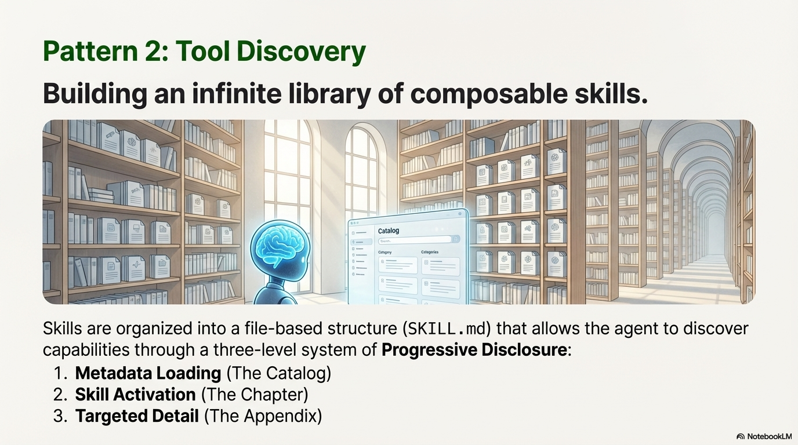

# Pattern: Skill Discovery 

## Motivation

A carpenter doesn't need to know every tool's full specification upfront—they know which tools exist, what each does, and can look up detailed instructions when working on a specific task. 
When learning a new skill, you don't start by memorizing every detail. 
You first understand what the skill does, then learn the basics, and only dive into advanced details when needed. 


As model capabilities improve, we can now build general-purpose agents that interact with full-fledged computing environments. 
But as these agents become more powerful, we need more composable, scalable, and portable ways to equip them with domain-specific expertise. 
Building a skill for an agent is like putting together an onboarding guide for a new hire. 
Instead of building fragmented, custom-designed agents for each use case, anyone can now specialize their agents with composable capabilities by capturing and sharing their procedural knowledge.

The Skill pattern (also known as the SKILL.md pattern or Agent Skills pattern) brings this natural, progressive learning approach to agent systems, serving two complementary purposes: (1) enabling agents to discover available capabilities through lightweight metadata, and (2) providing detailed procedural knowledge—step-by-step instructions, workflows, and best practices—that agents can load on demand. 
This pattern transforms general-purpose agents into specialized agents that fit your needs by packaging expertise into composable resources.


> **"Skills turn an LLM from a speaker into a worker."** — LangChain / LangGraph



## Pattern Overview

**What it is:** The Agent Skills pattern (exemplified by the `SKILL.md` file structure) is an engineering approach for building specialized agents using files and folders. 
A skill is a directory containing a `SKILL.md` file that contains organized folders of instructions, scripts, and resources that give agents additional capabilities. 
This pattern serves a dual purpose: (1) **Capability Discovery**—enabling agents to discover what capabilities are available through lightweight metadata, and (2) **Procedural Knowledge Codification**—providing detailed step-by-step procedures, workflows, and best practices that agents can load on demand. 
This pattern provides procedural knowledge and organizational context to general-purpose agents, allowing them to accomplish complex, domain-specific tasks through progressive disclosure of information. 
Skills extend an agent's capabilities by packaging your expertise into composable resources, transforming general-purpose agents into specialized agents.

**When to use:** Use this pattern when building agents that need access to multiple specialized capabilities, when you want to organize procedural knowledge in a scalable way, or when you need to optimize token usage by loading information only as needed. 
This pattern is particularly valuable for multi-agent systems where different agents may need different skill sets.

**Why it matters:** Traditional approaches load all tool definitions and instructions into the agent's context upfront, leading to context bloat and wasted tokens.

The SKILL pattern enables agents to discover capabilities through metadata, activate skills on demand, and access detailed procedural instructions only when needed. 
Unlike simple tool registries that only list available tools, skills encode complete workflows and procedures—the "how to" knowledge that enables agents to execute complex tasks consistently. 
This creates a scalable, composable system where the amount of knowledge an agent can access is effectively unbounded, limited only by storage, not by context window size.
This pattern practically transforms the filesystem into an external knowledge base that agents can navigate and explore, similar to how humans use reference materials. 
Just as a developer doesn't need the entire API documentation in their working memory, an agent doesn't need every skill's full instructions loaded at startup.


> **"Agents need a clean skill surface. Every tool should feel like a verb."** — Manus


### Key Concepts

- **SKILL.md File:** A structured markdown file containing YAML frontmatter (metadata) and detailed instructions for a specific capability.
- **Progressive Disclosure:** A three-level information loading strategy that minimizes context usage by loading only what's needed at each stage.
- **Skill Directory:** A folder containing a `SKILL.md` file along with supporting files, scripts, and resources.
- **Metadata Loading (Level 1):** Pre-loading only skill names and descriptions to enable capability discovery—agents learn what skills exist and when to use them.
- **Skill Activation (Level 2):** Loading the full `SKILL.md` contents when a skill is determined to be relevant—this includes complete procedural instructions, workflows, and step-by-step guidance.
- **Targeted Detail (Level 3):** Navigating to linked files within the skill directory for additional context when needed—supporting documentation, examples, or advanced procedures.
- **Filesystem as Context:** Treating the filesystem as an external, navigable knowledge base that agents can explore on demand.
- **Code Execution:** Skills can include executable code (scripts, tools) that agents can run at their discretion, providing deterministic reliability and efficiency for operations better suited to traditional code execution.

### How It Works

The SKILL pattern operates through a three-level progressive disclosure mechanism:

1. **Level 1 (Metadata Loading):** At startup, the agent system pre-loads only the YAML frontmatter (name and description) from all installed skills. 
This lightweight metadata provides just enough information for the agent to understand what capabilities are available and when each skill should be used. 
This typically consumes only a few tokens per skill, regardless of how detailed the skill instructions are.

2. **Level 2 (Skill Activation):** When the agent determines that a skill is relevant to the current task, it reads the full contents of the `SKILL.md` file into its context. 
This includes the complete procedural knowledge: step-by-step instructions, workflows, best practices, and detailed guidance for executing the skill's tasks. 
The agent may use filesystem tools (like `read_file`) to load this content on demand.

3. **Level 3 (Targeted Detail):** If the skill's complexity requires additional detail beyond what's in `SKILL.md`, the agent can navigate the skill directory and read linked files. 
This allows skills to bundle supporting documentation, examples, scripts, or other resources that are referenced from the main `SKILL.md` file.

This mechanism allows the agent to interact with the filesystem as its external context. 
Since the agent only reads files on demand, the amount of context that can be bundled into a skill is effectively unbounded—limited only by storage capacity, not by context window constraints.
Like a well-organized manual that starts with a table of contents, then specific chapters, and finally a detailed appendix, skills let agents load information only as needed. 
Agents with a filesystem and code execution tools don't need to read the entirety of a skill into their context window when working on a particular task.

## When to Use This Pattern

### ✅ Use this pattern when:

- **Multiple specialized capabilities needed:** Your agent needs access to many different skills or tools, and loading all definitions upfront would bloat the context window.
- **Scalable skill management:** You want to add new capabilities without modifying the core agent system or system prompt.
- **Token efficiency is critical:** You need to minimize context usage, especially when many skills exist but only a few are used per task.
- **Composable agent systems:** You're building systems where skills can be mixed and matched across different agents or configurations.
- **Organizational knowledge management:** You want to codify successful approaches, procedures, or workflows into reusable, version-controlled capabilities.
- **Multi-agent architectures:** Different agents need different skill sets, and you want a unified way to manage and distribute capabilities.
- **Dynamic capability discovery:** You want agents to discover and learn about new capabilities at runtime rather than having everything hardcoded.

### ❌ Avoid this pattern when:

- **Simple, single-purpose agents:** Your agent has a single, well-defined purpose and doesn't need multiple capabilities.
- **All skills always needed:** If every task requires all available skills, the progressive disclosure overhead isn't beneficial.
- **Tight latency requirements:** The overhead of reading files on demand may introduce unacceptable latency for real-time applications.
- **Minimal skill set:** When you have only a few, small skills, the organizational overhead may not be justified.
- **Static, unchanging capabilities:** If your agent's capabilities never change, simpler approaches may suffice.

### Decision Guidelines

Choose the SKILL pattern when the benefits of progressive disclosure, scalability, and composability outweigh the added complexity of file-based organization. 
Consider your skill count: if you have many skills (10+), progressive disclosure becomes valuable. 
Consider token costs: if loading all skill definitions would consume significant context, progressive disclosure saves tokens. 
Consider maintainability: if you want to add or modify skills without changing core agent code, the SKILL pattern provides clean separation. 
However, if your agent is simple and has few capabilities, the overhead may not be justified.

## Practical Applications & Use Cases

The SKILL pattern is widely used in production agent systems for organizing and managing specialized capabilities:

### 1. Anthropic's Claude Agent Skills
**Use Case:** Anthropic's Claude Code and Claude Agent SDK use the `SKILL.md` pattern to extend Claude's capabilities. 
Skills are supported across Claude.ai, Claude Code, the Claude Agent SDK, and the Claude Developer Platform.

**Real Example - PDF Skill:** Claude already knows a lot about understanding PDFs, but is limited in its ability to manipulate them directly (e.g., to fill out a form). 
A PDF skill provides Claude with these new abilities:

- The skill directory contains `SKILL.md` with instructions for PDF manipulation
- Additional files like `reference.md` and `forms.md` are bundled for specific scenarios
- The skill includes Python scripts that Claude can execute to extract form fields from PDFs
- Claude loads the skill only when PDF-related tasks are detected

- **Skill Structure:** Each skill is a directory containing `SKILL.md` with YAML frontmatter and detailed instructions.
- **Agent Flow:** At startup, Claude pre-loads skill metadata (names and descriptions) into its system prompt. 
When a user request matches a skill description, Claude invokes a Bash tool to read the full `SKILL.md` contents, then proceeds with the task.
- **Benefits:** Allows Claude to support many specialized capabilities without context bloat, and enables users to add custom skills by creating new directories. Skills can be shared across organizations and individuals.

### 2. Deep Agents Framework
**Use Case:** Lamgchain's Deep Agents uses the `SKILL.md` pattern to organize agent capabilities. 
Skills are stored as directories with `SKILL.md` files, and agents automatically discover and activate relevant skills based on user requests.

- **Skill Structure:** Each skill is a directory containing `SKILL.md` with YAML frontmatter and detailed instructions.
- **Agent Flow:** The agent's system prompt includes skill metadata (names and descriptions). When a user request matches a skill, the agent reads the full `SKILL.md` file and executes the skill.
- **Benefits:** Allows Deep Agents to support many skills without context bloat, and enables users to add custom skills by creating new directories.

### 3. Multi-Agent Skill Libraries
**Use Case:** Organizations building agent systems can maintain a shared library of skills that different agents can access.

- **Skill Library:** A centralized repository of `SKILL.md` files for common tasks (data analysis, report generation, code review, etc.).
- **Agent Configuration:** Different agents are configured with access to different skill sets based on their roles.
- **Benefits:** Skills can be developed once and reused across multiple agents, with version control and centralized updates.

### 4. Domain-Specific Agent Specialization
**Use Case:** Building specialized agents for specific domains (legal, medical, financial) where each domain has many specialized procedures.

- **Domain Skills:** Each domain has a collection of skills (e.g., "contract_analysis", "regulatory_compliance", "risk_assessment").
- **Agent Activation:** The agent loads domain-relevant skills based on the task context.
- **Benefits:** Agents can handle complex domain-specific tasks without requiring all domain knowledge in the base model.

### 5. Procedural Knowledge Codification
**Use Case:** Capturing organizational best practices, workflows, and procedures as reusable skills.

- **Process Skills:** Skills encode step-by-step procedures for common tasks (e.g., "customer_onboarding", "incident_response", "code_deployment").
- **Knowledge Preservation:** Skills serve as living documentation that agents can follow, ensuring consistency and preserving institutional knowledge.
- **Benefits:** Reduces reliance on individual expertise and enables consistent execution of complex procedures.

### 6. Tool and API Integration
**Use Case:** Wrapping external tools, APIs, or services as skills with clear usage instructions.

- **Tool Skills:** Each external integration is packaged as a skill with instructions on when and how to use it.
- **Agent Discovery:** Agents discover available integrations through skill metadata and load detailed usage instructions only when needed.
- **Benefits:** Clean separation between tool availability (metadata) and tool usage (detailed instructions), enabling better organization of complex integrations.

## Implementation

### Anatomy of a Skill

A skill is fundamentally organized as a directory that contains a `SKILL.md` file, along with structured folders for instructions, scripts, and resources.

#### 1. YAML Frontmatter

The `SKILL.md` file must begin with YAML frontmatter, which contains required metadata:

```yaml
---
name: "Data Analysis Skill"
description: "Analyzes datasets, generates statistics, and creates visualizations. Use this skill when the user asks about data patterns, trends, or statistical insights."
---
```

**Required Fields:**
- `name`: A clear, descriptive name for the skill
- `description`: A concise explanation of what the skill does and when it should be used

**Optional Fields:**
- `version`: Skill version for tracking changes
- `author`: Creator or maintainer information
- `tags`: Keywords for skill discovery
- `dependencies`: Other skills or tools required

#### 2. Skill Body

The main body of the `SKILL.md` file provides detailed instructions for the skill:

```markdown
# Data Analysis Skill

## Overview
This skill enables comprehensive data analysis including statistical summaries, trend identification, and visualization generation.

## When to Use
- User requests statistical analysis
- Questions about data patterns or trends
- Need for data visualizations
- Comparative analysis between datasets

## Procedure

1. **Load Data**: Use the `load_dataset` tool to retrieve the specified dataset
2. **Initial Exploration**: Generate basic statistics (mean, median, std dev)
3. **Pattern Analysis**: Identify trends, outliers, and correlations
4. **Visualization**: Create appropriate charts based on data type
5. **Report Generation**: Summarize findings in a clear, structured format

## Tools Required
- `load_dataset(filepath: str)`: Loads data from specified file
- `calculate_statistics(data: DataFrame)`: Computes statistical measures
- `create_visualization(data: DataFrame, chart_type: str)`: Generates charts

## Examples

**Example 1: Basic Statistics**
User: "What are the key statistics for sales_data.csv?"
1. Load sales_data.csv
2. Calculate mean, median, standard deviation
3. Report findings

**Example 2: Trend Analysis**
User: "Show me the sales trend over the past year"
1. Load sales data
2. Group by month
3. Create line chart
4. Identify trend direction
```

#### 3. Linked Files

If the complexity or size of the content exceeds what fits into a single `SKILL.md`, the skill can bundle additional files:

```markdown
## Advanced Usage

For complex analysis scenarios, see [advanced_examples.md](./advanced_examples.md).

## API Reference

Detailed tool specifications are available in [tools.md](./tools.md).
```

The skill directory structure might look like:

```
data_analysis_skill/
├── SKILL.md
├── advanced_examples.md
├── tools.md
└── scripts/
    └── preprocessing.py
```

#### 4. Executable Code

Skills can also include code for agents to execute as tools at their discretion. 
Large language models excel at many tasks, but certain operations are better suited for traditional code execution. 
For example, sorting a list via token generation is far more expensive than simply running a sorting algorithm. Beyond efficiency concerns, many applications require the deterministic reliability that only code can provide.

In the PDF skill example, the skill includes a pre-written Python script that reads a PDF and extracts all form fields. 
The agent can run this script without loading either the script or the PDF into context. 
And because code is deterministic, this workflow is consistent and repeatable.

When including code in skills, it should be clear whether the agent should run scripts directly or read them into context as reference. 
Code can serve as both executable tools and as documentation.

### Basic Implementation

??? "Skill Discovery and Loading"

    ```python
    from pathlib import Path
    from typing import List, Dict, Optional
    import yaml
    import frontmatter

    class SkillManager:
        def __init__(self, skills_directory: str = "./skills"):
            self.skills_dir = Path(skills_directory)
            self.skills_metadata: Dict[str, Dict] = {}
            self.loaded_skills: Dict[str, str] = {}
        
        def discover_skills(self) -> List[Dict]:
            """Level 1: Load metadata from all SKILL.md files."""
            skills = []
            
            for skill_dir in self.skills_dir.iterdir():
                if not skill_dir.is_dir():
                    continue
                
                skill_file = skill_dir / "SKILL.md"
                if not skill_file.exists():
                    continue
                
                # Parse YAML frontmatter
                with open(skill_file, 'r') as f:
                    post = frontmatter.load(f)
                    metadata = post.metadata
                    skills.append({
                        "name": metadata.get("name", skill_dir.name),
                        "description": metadata.get("description", ""),
                        "path": str(skill_file),
                        "directory": str(skill_dir)
                    })
                    self.skills_metadata[metadata.get("name", skill_dir.name)] = {
                        "metadata": metadata,
                        "path": str(skill_file),
                        "directory": str(skill_dir)
                    }
            
            return skills
        
        def get_skill_metadata_summary(self) -> str:
            """Generate a summary of all skills for agent system prompt."""
            skills = self.discover_skills()
            summary = "Available Skills:\n\n"
            for skill in skills:
                summary += f"- **{skill['name']}**: {skill['description']}\n"
            return summary
        
        def load_skill(self, skill_name: str) -> Optional[str]:
            """Level 2: Load full SKILL.md content."""
            if skill_name in self.loaded_skills:
                return self.loaded_skills[skill_name]
            
            if skill_name not in self.skills_metadata:
                return None
            
            skill_path = Path(self.skills_metadata[skill_name]["path"])
            content = skill_path.read_text()
            self.loaded_skills[skill_name] = content
            return content
        
        def read_skill_file(self, skill_name: str, filename: str) -> Optional[str]:
            """Level 3: Read a linked file from skill directory."""
            if skill_name not in self.skills_metadata:
                return None
            
            skill_dir = Path(self.skills_metadata[skill_name]["directory"])
            file_path = skill_dir / filename
            
            if not file_path.exists():
                return None
            
            return file_path.read_text()

    # Usage
    skill_manager = SkillManager("./skills")

    # Level 1: Get metadata for system prompt
    system_prompt = f"""
    You are a helpful assistant with access to specialized skills.

    {skill_manager.get_skill_metadata_summary()}

    When a user request matches a skill description, you can load that skill's full instructions.
    """

    # Level 2: Agent determines "Data Analysis Skill" is needed
    skill_content = skill_manager.load_skill("Data Analysis Skill")
    # Inject skill_content into agent context

    # Level 3: Agent needs additional detail
    advanced_examples = skill_manager.read_skill_file("Data Analysis Skill", "advanced_examples.md")
    ```

**Explanation:**
This implementation demonstrates the three-level progressive disclosure. 
The `discover_skills()` method performs Level 1 metadata loading, `load_skill()` performs Level 2 activation, and `read_skill_file()` enables Level 3 targeted detail access.

??? "Advanced Implementation: Filesystem Tools Integration"

    ```python
    from pathlib import Path
    from typing import Optional

    class SkillFilesystemTools:
        """Tools for agents to interact with skills via filesystem."""
        
        def __init__(self, skills_directory: str = "./skills"):
            self.skills_dir = Path(skills_directory)
        
        def list_skills(self) -> str:
            """List all available skills with their descriptions."""
            skills = []
            for skill_dir in self.skills_dir.iterdir():
                if not skill_dir.is_dir():
                    continue
                
                skill_file = skill_dir / "SKILL.md"
                if not skill_file.exists():
                    continue
                
                # Read just the frontmatter
                with open(skill_file, 'r') as f:
                    post = frontmatter.load(f)
                    metadata = post.metadata
                    skills.append({
                        "name": metadata.get("name", skill_dir.name),
                        "description": metadata.get("description", "")
                    })
            
            if not skills:
                return "No skills found."
            
            result = "Available Skills:\n\n"
            for skill in skills:
                result += f"- **{skill['name']}**: {skill['description']}\n"
            return result
        
        def read_skill(self, skill_name: str) -> str:
            """Read the full contents of a SKILL.md file."""
            # Find skill directory by name
            for skill_dir in self.skills_dir.iterdir():
                if not skill_dir.is_dir():
                    continue
                
                skill_file = skill_dir / "SKILL.md"
                if not skill_file.exists():
                    continue
                
                with open(skill_file, 'r') as f:
                    post = frontmatter.load(f)
                    metadata = post.metadata
                    if metadata.get("name") == skill_name:
                        return skill_file.read_text()
            
            return f"Skill '{skill_name}' not found. Use list_skills() to see available skills."
        
        def read_skill_file(self, skill_name: str, filename: str) -> str:
            """Read a file from within a skill's directory."""
            # Find skill directory
            for skill_dir in self.skills_dir.iterdir():
                if not skill_dir.is_dir():
                    continue
                
                skill_file = skill_dir / "SKILL.md"
                if not skill_file.exists():
                    continue
                
                with open(skill_file, 'r') as f:
                    post = frontmatter.load(f)
                    metadata = post.metadata
                    if metadata.get("name") == skill_name:
                        target_file = skill_dir / filename
                        if target_file.exists():
                            return target_file.read_text()
                        else:
                            return f"File '{filename}' not found in skill '{skill_name}'."
            
            return f"Skill '{skill_name}' not found."
        
        def list_skill_files(self, skill_name: str) -> str:
            """List all files in a skill's directory."""
            for skill_dir in self.skills_dir.iterdir():
                if not skill_dir.is_dir():
                    continue
                
                skill_file = skill_dir / "SKILL.md"
                if not skill_file.exists():
                    continue
                
                with open(skill_file, 'r') as f:
                    post = frontmatter.load(f)
                    metadata = post.metadata
                    if metadata.get("name") == skill_name:
                        files = [f.name for f in skill_dir.iterdir() if f.is_file()]
                        dirs = [f.name + "/" for f in skill_dir.iterdir() if f.is_dir()]
                        return "\n".join(sorted(dirs + files))
            
            return f"Skill '{skill_name}' not found."

    # Agent with skill tools
    skill_tools = SkillFilesystemTools("./skills")

    # Agent can use these tools to discover and load skills
    # 1. Agent calls list_skills() to see what's available
    # 2. Agent determines "Data Analysis Skill" is relevant
    # 3. Agent calls read_skill("Data Analysis Skill") to load full instructions
    # 4. If needed, agent calls read_skill_file("Data Analysis Skill", "advanced_examples.md")
    ```

**Explanation:**
This advanced implementation provides filesystem tools that agents can use to interact with skills. The agent can discover skills, load their instructions, and access supporting files, all through tool calls rather than pre-loading everything.

### Framework-Specific Examples

#### Deep Agents Integration

```python
# Example skill directory structure
# Skills are organized in directories:

"""
skills/
├── data_analysis/
│   ├── SKILL.md
│   └── examples.md
├── code_review/
│   ├── SKILL.md
│   └── checklist.md
└── report_generation/
    ├── SKILL.md
    └── templates/
        └── template1.md
"""

# Deep Agents framework workflow:
# 1. Reads SKILL.md frontmatter at startup
# 2. Includes skill metadata in agent system prompt
# 3. Agent uses filesystem tools to read full SKILL.md when needed
# 4. Agent can navigate skill directories for additional files

# Example SKILL.md structure:
skill_example = """
---
name: Data Analysis
description: Analyze datasets and generate insights
tools: [pandas, numpy, matplotlib]
---

# Data Analysis Skill

This skill enables the agent to analyze datasets...
"""

print("Skill directory structure example:")
print(skill_example)
```

??? LangChain Agent with Skills

    ```python
    from langchain.agents import AgentExecutor, create_tool_calling_agent
    from langchain_core.tools import tool
    from langchain_openai import ChatOpenAI
    from pathlib import Path
    import frontmatter

    # Skill filesystem tools
    @tool
    def list_skills() -> str:
        """List all available skills with descriptions."""
        skills_dir = Path("./skills")
        skills = []
        for skill_dir in skills_dir.iterdir():
            if skill_dir.is_dir():
                skill_file = skill_dir / "SKILL.md"
                if skill_file.exists():
                    with open(skill_file, 'r') as f:
                        post = frontmatter.load(f)
                        metadata = post.metadata
                        skills.append(f"- **{metadata.get('name')}**: {metadata.get('description')}")
        return "\n".join(skills) if skills else "No skills found."

    @tool
    def read_skill(skill_name: str) -> str:
        """Read the full instructions for a skill. Use this when you determine a skill is relevant to the task."""
        skills_dir = Path("./skills")
        for skill_dir in skills_dir.iterdir():
            if skill_dir.is_dir():
                skill_file = skill_dir / "SKILL.md"
                if skill_file.exists():
                    with open(skill_file, 'r') as f:
                        post = frontmatter.load(f)
                        if post.metadata.get("name") == skill_name:
                            return skill_file.read_text()
        return f"Skill '{skill_name}' not found."

    # Agent with skill tools
    llm = ChatOpenAI(model="gpt-4", temperature=0)
    tools = [list_skills, read_skill]

    agent_prompt = """You are a helpful assistant with access to specialized skills.

    You can use the list_skills tool to see what capabilities are available.
    When a user request matches a skill description, use read_skill to load that skill's instructions.
    Then follow the skill's procedures to complete the task.
    """

    agent = create_tool_calling_agent(llm, tools, agent_prompt)
    executor = AgentExecutor(agent=agent, tools=tools, verbose=True)

    # Agent automatically discovers and uses skills
    result = executor.invoke({"input": "Analyze the sales data and create a report"})
    ```

??? "Google ADK Integration"

    ```python
    from google.adk.agents import Agent
    from google.adk.tools import FunctionTool
    from pathlib import Path
    import frontmatter

    def list_skills_tool() -> str:
        """List available skills."""
        skills_dir = Path("./skills")
        skills = []
        for skill_dir in skills_dir.iterdir():
            if skill_dir.is_dir():
                skill_file = skill_dir / "SKILL.md"
                if skill_file.exists():
                    with open(skill_file, 'r') as f:
                        post = frontmatter.load(f)
                        skills.append(f"- {post.metadata.get('name')}: {post.metadata.get('description')}")
        return "\n".join(skills)

    def read_skill_tool(skill_name: str) -> str:
        """Read skill instructions."""
        skills_dir = Path("./skills")
        for skill_dir in skills_dir.iterdir():
            if skill_dir.is_dir():
                skill_file = skill_dir / "SKILL.md"
                if skill_file.exists():
                    with open(skill_file, 'r') as f:
                        post = frontmatter.load(f)
                        if post.metadata.get("name") == skill_name:
                            return skill_file.read_text()
        return f"Skill not found: {skill_name}"

    # Create agent with skill tools
    agent = Agent(
        name="SkillBasedAgent",
        model="gemini-2.0-flash",
        instruction="""You have access to specialized skills organized as SKILL.md files.

    Use list_skills_tool to discover available capabilities.
    When a user request matches a skill, use read_skill_tool to load the skill's instructions.
    Follow the skill's procedures to complete the task.""",
        tools=[FunctionTool(list_skills_tool), FunctionTool(read_skill_tool)]
    )
    ```

## Integration with Agent Architectures

The `SKILL.md` pattern integrates seamlessly with multi-agent frameworks, often being tied to the planning and execution loops of deep agent architectures.

### Execution Flow and Context Window Management

The sequence of operations when a skill is triggered:

1. **Initial State:** The context window contains:
   - Core system prompt
   - Metadata for each installed skill (name and description only)
   - User's initial message

2. **Skill Triggering:** The agent analyzes the user's request against available skill descriptions and determines a skill is relevant.

3. **Skill Activation:** The agent invokes a filesystem tool (like a Bash tool) to read the contents of the skill's `SKILL.md` file. This loads the full skill instructions into context.

4. **Targeted Detail Loading:** If needed, the agent chooses to read additional files bundled with the skill (e.g., `forms.md`, `reference.md`, or executable scripts).

5. **Task Execution:** The agent proceeds with the user's task, now equipped with the relevant skill instructions and any additional context it has loaded.

This progressive disclosure mechanism ensures the context window remains focused and efficient, loading only what's needed at each stage of the task.

### Framework Integration Examples

**Anthropic Claude:** Skills are supported across Claude.ai, Claude Code, the Claude Agent SDK, and the Claude Developer Platform. The framework automatically handles skill discovery, metadata loading, and skill activation through filesystem tools.

**Deep Agents:** Frameworks like Deep Agents automatically read the relevant `SKILL.md` file and execute the skill when a request is related to it. The framework:

1. Scans the skills directory at startup and loads metadata from all `SKILL.md` files into the agent's system prompt
2. Analyzes user requests against available skill descriptions
3. Invokes filesystem tools to read full `SKILL.md` contents when a skill matches
4. Follows the skill's instructions, potentially reading additional files from the skill directory as needed

This method allows organizations to codify successful approaches into reusable capabilities, enabling continuous iteration and improvement based on observational feedback. Skills become version-controlled, testable units of agent capability that can be shared, refined, and composed.

## Developing and Evaluating Skills

Here are helpful guidelines for getting started with authoring and testing skills, based on production experience:

### Start with Evaluation

Identify specific gaps in your agents' capabilities by running them on representative tasks and observing where they struggle or require additional context. Then build skills incrementally to address these shortcomings. Don't try to anticipate everything upfront—let real usage guide what context the agent actually needs.

### Structure for Scale

When the `SKILL.md` file becomes unwieldy, split its content into separate files and reference them. If certain contexts are mutually exclusive or rarely used together, keeping the paths separate will reduce token usage. Finally, code can serve as both executable tools and as documentation. It should be clear whether the agent should run scripts directly or read them into context as reference.

### Think from the Agent's Perspective

Monitor how the agent uses your skill in real scenarios and iterate based on observations: watch for unexpected trajectories or overreliance on certain contexts. Pay special attention to the `name` and `description` of your skill—the agent will use these when deciding whether to trigger the skill in response to its current task. These fields are critical for accurate skill selection.

### Iterate with the Agent

As you work on a task with the agent, ask it to capture its successful approaches and common mistakes into reusable context and code within a skill. 
If it goes off track when using a skill to complete a task, ask it to self-reflect on what went wrong. 
This process will help you discover what context the agent actually needs, instead of trying to anticipate it upfront.

## Security Considerations

Skills provide agents with new capabilities through instructions and code. 
While this makes them powerful, it also means that malicious skills may introduce vulnerabilities in the environment where they're used or direct agents to exfiltrate data and take unintended actions.

**Best Practices:**

- **Install from Trusted Sources:** We recommend installing skills only from trusted sources. When installing a skill from a less-trusted source, thoroughly audit it before use.
- **Audit Skill Contents:** Start by reading the contents of the files bundled in the skill to understand what it does, paying particular attention to:

    - Code dependencies and bundled resources like images or scripts
    - Instructions or code that instruct the agent to connect to potentially untrusted external network sources
    - File system access patterns and permissions required

- **Review Executable Code:** Since skills can include executable code, carefully review any scripts or tools included in the skill to ensure they don't perform unintended actions or access sensitive data.
- **Sandbox Execution:** Consider running skills in sandboxed environments, especially when skills include executable code or interact with external systems.

## Key Takeaways
- **Dual Purpose:** The SKILL pattern serves both tool discovery (finding what capabilities exist) and procedural knowledge codification (encoding how to perform tasks). Skills are more than tool registries—they contain complete workflows and procedures.
- **Progressive Disclosure is Key:** The three-level disclosure mechanism (metadata → full instructions → linked files) prevents context bloat while enabling unlimited knowledge capacity.
- **Filesystem as Context:** The pattern transforms the filesystem into an external, navigable knowledge base that agents can explore on demand, similar to how humans use reference materials.
- **Scalability:** The amount of knowledge an agent can access is effectively unbounded, limited only by storage capacity, not by context window constraints.
- **Composability:** Skills are modular, reusable units that can be mixed and matched across different agents and configurations.
- **Token Efficiency:** Loading only skill metadata at startup and activating skills on demand dramatically reduces token usage compared to loading all definitions upfront.
- **Organizational Knowledge:** Skills serve as living documentation that preserves institutional knowledge and enables consistent execution of complex procedures.
- **Version Control:** Skills can be version-controlled, tested independently, and updated without modifying core agent systems.
- **Best Practice:** Design skills with clear metadata (name and description) that enables accurate skill selection, and structure detailed procedural instructions that are self-contained yet can reference supporting files when needed.
- **Code Execution:** Skills can include executable code that agents run for deterministic, efficient operations, but code should be clearly distinguished from documentation.
- **Security First:** Always audit skills from untrusted sources, paying attention to executable code, dependencies, and network access patterns.

## Related Patterns

This pattern works well with:
- **Filesystem as Context:** The SKILL pattern is a specific application of using the filesystem as external memory, with a structured organization for procedural knowledge.

- **Tool Use & Execution:** Skills often define how to use specific tools, and the skill activation mechanism uses filesystem tools to load skill content.

- **Multi-Agent Architectures:** Different agents can have access to different skill sets, and skills can be shared across agents in a multi-agent system.

- **Routing:** Agents can use routing logic to determine which skills are relevant to a given task based on skill metadata.

- **Planning:** Skills can be incorporated into agent plans, with the agent loading skill instructions as part of plan execution.

This pattern is often combined with:
- **Knowledge Retrieval (RAG):** Skills can reference knowledge bases, and RAG can be used to find relevant skills based on semantic similarity.

- **Memory Management:** Skill metadata can be cached, and skill usage can be tracked in agent memory for optimization.

- **Reflection:** Agents can reflect on skill effectiveness and update skill instructions based on performance feedback.

??? "References"

    - Anthropic Engineering Blog: [Equipping agents for the real world with Agent Skills](https://www.anthropic.com/engineering/equipping-agents-for-the-real-world-with-agent-skills) - The original blog post introducing the SKILL pattern by Anthropic
    - Deep Agents Framework: SKILL.md pattern implementation
    - Agentic Design Patterns: Building composable agent capabilities
    - Context Engineering: Progressive disclosure strategies for LLM agents
    - Filesystem as Context: Using external storage for agent knowledge
    - YAML Frontmatter Specification: https://jekyllrb.com/docs/front-matter/
    - Python Frontmatter Library: https://github.com/eyeseast/python-frontmatter

