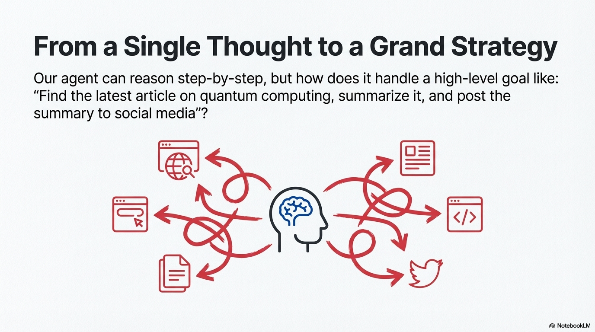
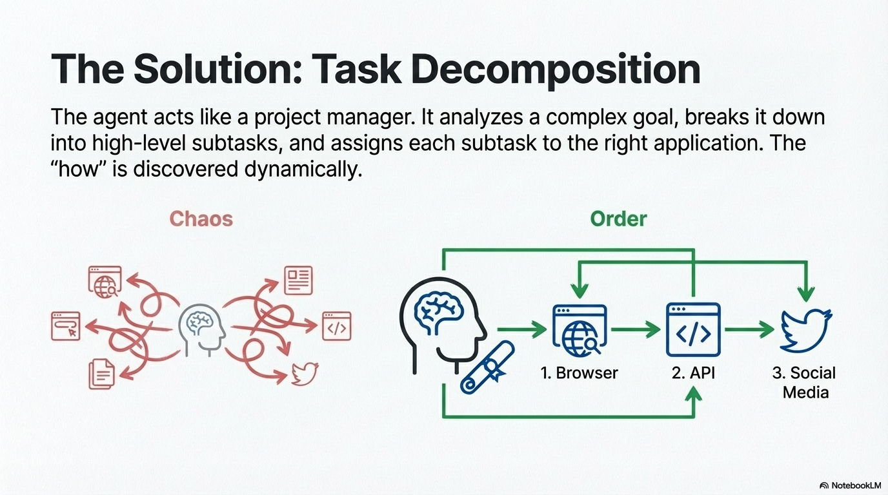
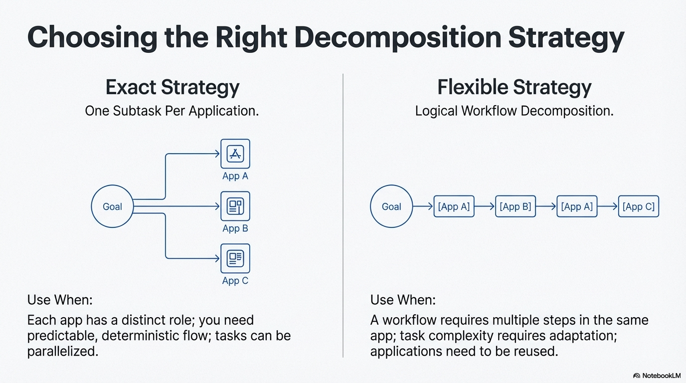

# Pattern: Task Decomposition 

## Motivation

When planning a trip, you break it down into steps: choose destination, book flights, reserve hotels, create an itinerary, pack. 
You consider dependencies (can't pack before deciding what to bring) and adapt when obstacles arise (flight cancelled, hotel unavailable). 
Task decomposition planning in agents works the same way: taking a high-level goal and autonomously breaking it down into a structured sequence of subtasks, each assigned to the appropriate application or service, then orchestrating their execution while adapting as conditions change.



## Pattern Overview

### Problem

Complex goals often require coordinating multiple applications or services in a specific sequence, but the exact "how" to achieve the goal may not be known in advance. Agents need to move beyond reactive behavior to goal-oriented, strategic problem-solving, transforming high-level objectives into structured, executable sequences of subtasks. Without task decomposition, agents cannot handle multi-step workflows that span multiple systems, and they lack the ability to adapt when conditions change or obstacles arise.

### Solution

Task decomposition enables agents to analyze complex goals, break them down into high-level subtasks, assign each subtask to the appropriate application or service, and orchestrate their execution in a logical sequence. The agent acts like a project manager, receiving a high-level goal (the "what") and dynamically discovering the "how" by analyzing the goal and available resources.

The process involves three core phases: task analysis (classifying task characteristics and matching to applications), task decomposition (breaking down the goal into high-level subtasks assigned to appropriate applications), and plan control (orchestrating execution, tracking progress, and managing data flow between subtasks). A hallmark of this process is adaptability—the initial decomposition is a starting point, not a rigid script. When obstacles arise or conditions change, the agent can re-evaluate options and reformulate the decomposition or adjust the execution plan.

However, task decomposition is not always the right choice. When a problem's solution is well-understood and repeatable, constraining the agent to a predetermined, fixed workflow is more effective. The decision to use task decomposition versus a simple task-execution agent hinges on a single question: does the "how" need to be discovered, or is it already known?




### Key Concepts

- **Three-Phase Architecture:** Task Analysis (classify characteristics, match to applications) → Task Decomposition (break down into subtasks, assign to applications) → Plan Control (orchestrate execution, track progress, manage data flow).
- **Task Analysis Components:** Task classification (updates, memory, loops, location search), application matching (interactive interfaces or programmatic services), intent paraphrasing (for complex/ambiguous intents), navigation path discovery (for interactive applications).
- **Decomposition Principles:** High-level abstraction (describe "what" not "how"), type-aware assignment (assign interaction types to enable specialized execution), context preservation (maintain user pronouns and identifiers), explicit dependency handling (reference data from previous steps).
- **Decomposition Strategies:** Exact (one subtask per application, strict boundaries) or Flexible (logical decomposition, multiple subtasks per app with alternating constraint). See **Planning Strategies** for details.
- **Application Handling:** Single application returns intent verbatim (no decomposition); multi-application decomposes based on chosen strategy, ensuring all apps contribute meaningfully.
- **Plan Execution Control:** Progress tracking (monitor subtask status), variable management (track data between subtasks), next action selection (based on dependencies and history), task conclusion (determine when goal is achieved).

### How It Works

Task decomposition works through a structured three-phase process that integrates task analysis, decomposition, and execution control:

**Phase 1: Task Analysis**

Before decomposition, the agent analyzes the task to understand its requirements and identify available resources:

- **Task Classification:** The agent classifies task characteristics such as whether it performs updates, requires memory, involves loops, or needs location-based information.
- **Application Matching:** The agent matches the user intent to available applications or services based on their capabilities and descriptions, considering different interaction types (interactive interfaces or programmatic services).
- **Intent Refinement:** For complex or ambiguous intents, the agent may paraphrase to clarify requirements or identify known efficient paths to accomplish the task.
- **Resource Discovery:** The agent identifies available applications, tools, and services, understanding their capabilities and constraints before planning how to use them.

**Phase 2: Task Decomposition**

The agent breaks down the goal into high-level subtasks using one of two strategies:

- **Single Application Handling:** If only one application is involved, return the intent verbatim as a single subtask (no decomposition needed).
- **Multi-Application Decomposition:** When multiple applications are involved, decompose using either:
    - **Exact Strategy:** One subtask per application, enforcing strict application boundaries
    - **Flexible Strategy:** Logical decomposition based on workflow requirements, allowing multiple subtasks per application with alternating constraints

For comprehensive details on these strategies, see the [Planning Strategies](../planning-strategies/module.md) module.

**Decomposition Principles:**

- **High-Level Abstraction:** Subtasks describe "what" needs to be accomplished, not "how" (avoid low-level implementation details like specific interaction methods or technical protocols).
- **Context Preservation:** Personal pronouns, identifiers, and user context are preserved across subtasks (e.g., "my accounts" remains "my accounts").
- **Explicit Dependencies:** When a subtask depends on previous steps, explicitly reference the data needed (e.g., "Using the account ID from the previous step, retrieve transaction history").
- **Answer Expectation:** If the intent contains question words, ensure one subtask explicitly provides that answer, with the final subtask delivering the response.

**Plan Generation:**

The decomposition creates a structured plan with an explanation of the strategy and a list of subtasks, each assigned to an appropriate application with a high-level description of what needs to be accomplished.

**Phase 3: Plan Execution Control**

A plan controller orchestrates the execution of the decomposed plan:

- **Progress Tracking:** Monitors each subtask's status (not-started, in-progress, completed) and maintains execution history.
- **Variable Management:** Captures data and outputs from completed subtasks, making them available to subsequent subtasks.
- **Next Action Selection:** Determines which subtask to execute next based on dependencies, progress status, and available variables, routing to appropriate specialized executors.
- **Execution & Adaptation:** Each subtask is executed by specialized planners that handle the specific interaction requirements. The controller monitors results and adapts when obstacles arise—subtask failures trigger re-evaluation, new constraints may require plan adjustment, and execution history informs future decisions.
- **Task Conclusion:** The controller decides when to conclude based on all subtasks being completed, the goal being achieved (even if not all subtasks completed), or an unrecoverable failure. The final answer is synthesized from execution results.





## When to Use This Pattern

### ✅ Use this pattern when:

- **Multi-application workflows:** The task requires coordinating multiple applications or services in a specific sequence.
- **Complex, multi-step goals:** The task requires a sequence of interdependent actions that must be discovered and coordinated across different systems.
- **Dynamic environments:** Conditions change during execution, requiring plan adaptation and re-decomposition.
- **Goal discovery needed:** The "how" to achieve the goal is not predetermined and must be discovered through analysis and decomposition.
- **Long-horizon tasks:** The task spans multiple steps where intermediate planning and coordination improve outcomes.
- **Diverse interaction types:** The task involves different types of interactions (interactive interfaces, programmatic services) that require specialized handling.
- **Data flow between steps:** The task requires passing data or results from one application to another.

### ❌ Avoid this pattern when:

- **Single application tasks:** The task can be handled by a single application (use direct execution instead).
- **Fixed workflows suffice:** The solution path is well-understood and can be hardcoded as a workflow.
- **Simple, single-step tasks:** The task can be completed in one or two steps without needing decomposition.
- **Predictability is critical:** You need guaranteed, consistent behavior that fixed workflows provide.
- **Real-time constraints:** The overhead of analysis, decomposition, and coordination adds unacceptable latency for time-sensitive tasks.
- **No application coordination:** The task doesn't require multiple applications or services to work together.

### Decision Guidelines

**When to Use Planning:**
Use planning when the benefits of adaptability and goal discovery outweigh the costs of increased complexity and potential unpredictability. 
Consider:

- **Task Complexity:** More complex = more benefit from planning
- **Environment Variability:** More variable = more need for adaptive planning
- **Solution Path:** Unknown = use planning, known = use workflow

**Choosing Decomposition Strategy:**

For detailed guidance on choosing between Exact and Flexible strategies, including when to use each and their characteristics, see the [Planning Strategies](../planning-strategies/module.md) module.

**Use Exact Strategy when:**

- Each application has a distinct, well-defined role
- Task naturally maps to one operation per application
- You need predictable, deterministic decomposition
- Parallel execution is desired (each app handles one subtask)
- Multi-domain tasks with clear boundaries

**Use Flexible Strategy when:**

- Workflow requires multiple operations within the same application
- Logical task flow doesn't align with strict one-per-app boundaries
- Sequential operations need to be broken down naturally
- Task complexity requires adaptive decomposition
- Applications need to be reused in the workflow

**General Considerations:**

- Planning adds latency and cost but improves outcomes for complex, multi-step tasks
- For single-application tasks, no decomposition is needed (return intent verbatim)
- For critical systems requiring guaranteed behavior, consider hybrid approaches that combine planning with fixed workflow fallbacks

## Practical Applications & Use Cases

Task decomposition planning is essential for autonomous systems that need to coordinate multiple applications or services to achieve complex goals.

- **Multi-Application Workflows:** Coordinate workflows that span multiple applications, such as finding information in a web portal, processing it through an API service, and posting results to social media.
- **Business Process Automation:** Decompose complex workflows like employee onboarding that require coordinating HR systems, email services, file storage, and access management applications.
- **Data Pipeline Orchestration:** Break down data processing tasks that require extracting data from one service, transforming it through another, and loading it into a third system.
- **Content Generation Workflows:** Formulate plans for complex outputs like research reports that require gathering information from web sources, analyzing it through AI services, and structuring it in document management systems.
- **Customer Support Automation:** Create systematic plans for multi-step problem resolution that coordinate ticketing systems, knowledge bases, communication platforms, and CRM systems.
- **E-commerce Operations:** Decompose tasks like "research product, compare prices, purchase, and update wishlist" across shopping sites, price comparison services, payment systems, and user profile services.
- **Project Management Automation:** Break down high-level projects into task sequences that coordinate project management tools, communication platforms, file storage, and reporting systems.


## Implementation

### Core Components

**Three-Phase Architecture:**

??? "Phase 1: Task Analyzer Agent"

    ```python
    from typing import List, Literal, Optional
    from pydantic import BaseModel, Field

    class TaskAttributes(BaseModel):
        """Task classification attributes."""
        thoughts: List[str]
        performs_update: bool
        requires_memory: bool
        requires_loop: bool
        requires_location_search: bool

    class AppMatch(BaseModel):
        """Application matching result."""
        thoughts: str
        relevant_apps: List[str]

    class TaskAnalyzerOutput(BaseModel):
        """Output from task analysis phase."""
        attrs: TaskAttributes
        paraphrased_intent: Optional[str] = None
        navigation_paths: Optional[dict] = None

    class TaskAnalyzerAgent:
        def __init__(self, llm):
            self.llm = llm
            self.classify_task = self._setup_classifier()
            self.match_apps = self._setup_app_matcher()
            self.paraphrase = self._setup_paraphrase()
            self.navigation_paths = self._setup_navigation_paths()
        
        async def analyze(self, intent: str, available_apps: List[dict]) -> TaskAnalyzerOutput:
            """Analyze task and match to applications."""
            # Classify task characteristics
            attrs = await self.classify_task.ainvoke({"task": intent})
            
            # Match intent to applications
            app_match = await self.match_apps.ainvoke({
                "intent": intent,
                "available_apps": available_apps
            })
            
            # Optional: Paraphrase intent for clarity
            paraphrased = None
            if attrs.performs_update == False:
                paraphrased = await self.paraphrase.ainvoke({"task": intent})
            
            # Optional: Discover navigation paths for web apps
            nav_paths = None
            if attrs.performs_update == False:
                nav_paths = await self.navigation_paths.ainvoke({"task": intent})
            
            return TaskAnalyzerOutput(
                attrs=attrs,
                paraphrased_intent=paraphrased.rephrased_intent if paraphrased else None,
                navigation_paths=nav_paths
            )
    ```

??? "Phase 2: Task Decomposition Agent"

    ```python
    from typing import List, Literal
    from pydantic import BaseModel, Field

    class DecomposedTask(BaseModel):
        """A single decomposed subtask."""
        task: str = Field(..., description="High-level task description")
        app: str = Field(..., description="Application name")
        type: Literal['web', 'api'] = Field(..., description="Task type")

    class TaskDecompositionPlan(BaseModel):
        """Complete decomposition plan."""
        thoughts: str = Field(..., description="Decomposition strategy explanation")
        task_decomposition: List[DecomposedTask] = Field(..., description="List of subtasks")
        
        def format_as_list(self) -> List[str]:
            """Format subtasks as list for display."""
            return [
                f"{task.task} (type='{task.type}', app='{task.app}')"
                for task in self.task_decomposition
            ]

    class TaskDecompositionAgent:
        def __init__(self, llm, strategy: Literal['exact', 'flexible'] = 'exact'):
            self.llm = llm
            self.strategy = strategy
        
        async def decompose(
            self, 
            intent: str, 
            applications: List[dict],
            current_datetime: str
        ) -> TaskDecompositionPlan:
            """Decompose task into subtasks based on strategy."""
            # Single app: return intent as-is (no decomposition)
            if len(applications) == 1:
                return TaskDecompositionPlan(
                    thoughts="Single application, no decomposition needed",
                    task_decomposition=[
                        DecomposedTask(
                            task=intent,
                            app=applications[0]["name"],
                            type=applications[0]["type"]
                        )
                    ]
                )
            
            # Multi-app: use strategy-based decomposition
            prompt = self._build_prompt(intent, applications, self.strategy, current_datetime)
            response = await self.llm.ainvoke(prompt)
            return TaskDecompositionPlan.model_validate_json(response.content)
        
        def _build_prompt(self, intent: str, apps: List[dict], strategy: str, datetime: str) -> str:
            """Build decomposition prompt based on strategy."""
            # Prompt includes:
            # - Intent
            # - Applications list with descriptions
            # - Current datetime
            # - Strategy-specific instructions (exact vs flexible)
            # - Examples demonstrating the strategy
            # - Rules for abstraction level, context preservation, dependencies
            pass
    ```

??? "Phase 3: Plan Controller Agent"

    ```python
    from typing import List, Literal, Optional
    from pydantic import BaseModel, Field

    class PlanControllerOutput(BaseModel):
        """Output from plan controller."""
        thoughts: List[str] = Field(..., description="Controller reasoning")
        subtasks_progress: List[Literal['completed', 'not-started', 'in-progress']] = Field(
            ..., description="Progress status for each subtask"
        )
        next_subtask: str = Field(..., description="Next subtask to execute")
        next_subtask_type: Literal['web', 'api', None] = Field(..., description="Type of next subtask")
        next_subtask_app: str = Field(..., description="Application for next subtask")
        conclude_task: bool = Field(False, description="Whether to conclude the task")
        conclude_final_answer: str = Field("", description="Final answer if concluding")

    class PlanControllerAgent:
        def __init__(self, llm):
            self.llm = llm
        
        async def control(
            self,
            plan: TaskDecompositionPlan,
            execution_history: List[dict],
            variables_history: List[dict],
            subtasks_progress: List[str]
        ) -> PlanControllerOutput:
            """Determine next action based on plan progress."""
            prompt = self._build_prompt(
                plan, execution_history, variables_history, subtasks_progress
            )
            response = await self.llm.ainvoke(prompt)
            return PlanControllerOutput.model_validate_json(response.content)
        
        def _build_prompt(
            self,
            plan: TaskDecompositionPlan,
            history: List[dict],
            variables: List[dict],
            progress: List[str]
        ) -> str:
            """Build control prompt with plan, history, and progress."""
            # Prompt includes:
            # - Current decomposition plan
            # - Execution history for each subtask
            # - Variables available from completed subtasks
            # - Current progress status
            # - Instructions for selecting next subtask or concluding
            pass
    ```

??? "Complete Example: Three-Phase Task Decomposition"

    ```python
    import asyncio
    from datetime import datetime

    # Example: "Find article about AI, summarize it, and share on social media"
    intent = "Find article about AI, summarize it, and share on social media"

    # Phase 1: Task Analysis
    async def phase1_task_analysis(intent: str):
        """Analyze task and match to applications."""
        analyzer = TaskAnalyzerAgent(llm)
        
        # Classify task characteristics
        attrs = await analyzer.classify_task.ainvoke({"task": intent})
        # Output: TaskAttributes(performs_update=False, requires_memory=False, ...)
        
        # Match to available applications
        available_apps = [
            {"name": "News Portal", "description": "Web portal for technology news articles"},
            {"name": "Summarizer", "description": "Service providing text summarization capabilities"},
            {"name": "Social Media", "description": "Service for posting updates to social media"}
        ]
        
        app_match = await analyzer.match_apps.ainvoke({
            "intent": intent,
            "available_apps": available_apps
        })
        # Output: AppMatch(relevant_apps=["News Portal", "Summarizer", "Social Media"])
        
        # Get matched applications with full details
        matched_apps = [
            {"name": "News Portal", "type": "web", "url": "https://news.example.com"},
            {"name": "Summarizer", "type": "api"},
            {"name": "Social Media", "type": "api"}
        ]
        
        return matched_apps

    # Phase 2: Task Decomposition
    async def phase2_task_decomposition(intent: str, applications: list):
        """Decompose task into subtasks."""
        decomposer = TaskDecompositionAgent(llm, strategy="exact")
        
        current_datetime = datetime.now().isoformat()
        plan = await decomposer.decompose(intent, applications, current_datetime)
        
        return plan

    # Phase 3: Plan Execution Control
    async def phase3_plan_control(plan: TaskDecompositionPlan, execution_history: list):
        """Control plan execution."""
        controller = PlanControllerAgent(llm)
        
        # Track variables from completed subtasks
        variables_history = []  # e.g., [{"article_content": "..."}, {"summary": "..."}]
        subtasks_progress = ["not-started"] * len(plan.task_decomposition)
        
        # Controller determines next action
        control_output = await controller.control(
            plan, execution_history, variables_history, subtasks_progress
        )
        
        return control_output

    # Complete workflow
    async def main():
        # Phase 1: Analyze
        matched_apps = await phase1_task_analysis(intent)
        print(f"Matched applications: {[app['name'] for app in matched_apps]}")
        
        # Phase 2: Decompose
        plan = await phase2_task_decomposition(intent, matched_apps)
        print(f"\nDecomposition Plan:")
        print(f"Thoughts: {plan.thoughts}")
        for i, subtask in enumerate(plan.task_decomposition, 1):
            print(f"{i}. {subtask.task} ({subtask.type}, {subtask.app})")
        
        # Phase 3: Execute and control
        execution_history = []
        for subtask in plan.task_decomposition:
            # Execute subtask (simplified)
            result = f"Executed: {subtask.task}"
            execution_history.append({
                "subtask": subtask.task,
                "result": result,
                "status": "completed"
            })
            
            # Controller determines next action
            control = await phase3_plan_control(plan, execution_history)
            if control.conclude_task:
                print(f"\nTask complete! Final answer: {control.conclude_final_answer}")
                break
            print(f"\nNext: {control.next_subtask}")

    if __name__ == "__main__":
        asyncio.run(main())

    # Output:
    # Matched applications: ['News Portal', 'Summarizer', 'Social Media']
    #
    # Decomposition Plan:
    # Thoughts: Three distinct operations across three applications...
    # 1. Find and extract the content of the most recent article about 'AI' from News Portal (web, News Portal)
    # 2. Generate a brief summary of the AI article content (api, Summarizer)
    # 3. Post the generated article summary to Social Media (api, Social Media)
    #
    # Next: Find and extract the content of the most recent article about 'AI' from News Portal
    # ...
    # Task complete! Final answer: Successfully found, summarized, and shared the AI article.
    ```

??? "Advanced Example: Plan Execution with Controller"

    ```python
    # Mock implementation for demonstration
    from langchain_google_genai import ChatGoogleGenerativeAI

    llm = ChatGoogleGenerativeAI(model="gemini-2.0-flash", temperature=0)

    # Simplified example
    intent = "Find article about AI, summarize it, and share on social media"
    applications = [
        {"name": "News Portal", "type": "web"},
        {"name": "Summarizer", "type": "api"},
        {"name": "Social Media", "type": "api"}
    ]

    async def main():
        # Mock plan
        plan = {
            "task_decomposition": [
                {"task": "Find article about AI", "type": "web", "app": "News Portal"},
                {"task": "Summarize the article", "type": "api", "app": "Summarizer"},
                {"task": "Share summary on social media", "type": "api", "app": "Social Media"}
            ]
        }
        
        # Simplified execution
        execution_history = []
        variables = {}
        
        for subtask in plan["task_decomposition"]:
            # Mock execution
            result = f"Executed: {subtask['task']}"
            execution_history.append({
                "subtask": subtask["task"],
                "result": result,
                "status": "completed"
            })
            print(f"Completed: {subtask['task']}")
        
        print("Task complete!")

    if __name__ == "__main__":
        asyncio.run(main())
    ```

??? "Example: Flexible Strategy"

    ```python
    # Task requiring multiple operations in same app
    intent = "Create project folder, add files, get team list, set permissions"

    applications = [
        {"name": "File System", "type": "api"},
        {"name": "Team Management", "type": "api"}
    ]

    decomposer = DecompositionAgent(llm, strategy="flexible")
    import asyncio


    async def main():
        plan = await decomposer.decompose(intent, applications)

    if __name__ == "__main__":
        asyncio.run(main())
    ```

    ### Workflow Integration

    ```python
    # Simplified planning workflow example
    from typing import List

    async def planning_workflow(intent: str, applications: List[dict]):
        # Mock implementation
        plan = {
            "task_decomposition": [
                {"task": "Find article", "type": "web", "app": "News Portal"},
                {"task": "Summarize", "type": "api", "app": "Summarizer"}
            ]
        }
        
        # Simplified execution
        execution_history = []
        variables = {}
        
        for subtask in plan["task_decomposition"]:
            result = f"Executed: {subtask['task']}"
            execution_history.append({"subtask": subtask["task"], "result": result})
            print(f"Completed: {subtask['task']}")
        
        return "Task complete"

    async def main():
        intent = "Find article about AI and summarize it"
        applications = [
            {"name": "News Portal", "type": "web"},
            {"name": "Summarizer", "type": "api"}
        ]
        result = await planning_workflow(intent, applications)
        print(result)

    if __name__ == "__main__":
        asyncio.run(main())
    ```

## Scaling Laws for Task Decomposition

Understanding how decomposition depth affects success probability and cost is critical for designing scalable agentic systems. **Scaling Laws** provide mathematical relationships that guide decomposition decisions.

### The Fundamental Scaling Challenge

Without decomposition, error rates compound exponentially over long task sequences:

**Success Probability Without Decomposition:**
```
P(success) = (1 - p)^s
```
Where:
- `p` = per-step error rate (e.g., 0.01 for 1% error rate)
- `s` = number of steps

**Example:** For a task requiring 1,000,000 steps with a 1% per-step error rate:
```
P(success) = (1 - 0.01)^1,000,000 ≈ 0
```

The task has essentially zero probability of success without error correction.

### Scaling with Extreme Decomposition + Voting

With extreme decomposition and voting-based error correction, success probability can be maintained:

**Success Probability With Decomposition + Voting:**
```
P(success) ≈ 1 - (1 - p_vote)^(s/d)
```
Where:
- `p_vote` = error rate after voting (much lower than `p`, e.g., 0.001 for 0.1% error rate)
- `s` = number of steps
- `d` = decomposition depth (number of levels)

**Example:** For the same 1,000,000-step task with decomposition depth of 10 and voting reducing error rate to 0.1%:
```
P(success) ≈ 1 - (1 - 0.001)^(1,000,000/10) ≈ 1 - (0.999)^100,000
```

With proper voting, `p_vote << p`, enabling success even for million-step tasks.

### Cost Scaling

Decomposition depth affects computational cost:

**Cost Relationship:**
```
Cost ≈ s × (agents_per_step × cost_per_agent) × d
```
Where:
- `s` = number of steps
- `agents_per_step` = number of agents solving each atomic subtask (for voting)
- `cost_per_agent` = cost per agent call
- `d` = decomposition depth

**Trade-offs:**
- **Deeper decomposition:** More atomic subtasks, higher cost, but better error correction
- **Shallower decomposition:** Fewer atomic subtasks, lower cost, but errors compound more
- **Optimal depth:** Balances error correction benefits against computational cost

### Decomposition Depth Guidelines

**Shallow Decomposition (d = 1-3):**
- **Use when:** Short tasks (< 100 steps), high per-step accuracy (> 99%), cost-sensitive
- **Trade-off:** Lower cost, but errors compound more quickly
- **Success probability:** Good for short tasks, poor for long tasks

**Moderate Decomposition (d = 4-7):**
- **Use when:** Medium tasks (100-10,000 steps), moderate per-step accuracy (95-99%)
- **Trade-off:** Balanced cost and error correction
- **Success probability:** Good for medium tasks, may struggle with very long tasks

**Deep Decomposition (d = 8-15):**
- **Use when:** Long tasks (10,000+ steps), lower per-step accuracy (< 95%), high accuracy requirements
- **Trade-off:** Higher cost, but enables tasks that would be impossible otherwise
- **Success probability:** Enables million-step tasks with proper error correction

### Voting Impact on Scaling

Voting reduces effective error rate, enabling scaling:

**Error Rate Reduction:**
```
p_vote ≈ p^n / (n choose k)
```
Where:
- `p` = per-step error rate
- `n` = number of voting agents
- `k` = voting threshold

**Example:** With 5 agents and first-to-ahead-by-2 voting:
- If `p = 0.01` (1% error rate)
- `p_vote ≈ 0.01^5 / (5 choose 2) ≈ 0.0001` (0.01% error rate after voting)

Voting dramatically reduces effective error rate, enabling scaling to very long tasks.

### Practical Scaling Decisions

**When to Use Extreme Decomposition:**

1. **Task Length:** 
   - < 100 steps: Traditional decomposition sufficient
   - 100-1,000 steps: Consider moderate decomposition
   - 1,000+ steps: Extreme decomposition recommended

2. **Error Tolerance:**
   - High tolerance (5%+ errors acceptable): Traditional decomposition
   - Medium tolerance (1-5% errors): Moderate decomposition
   - Low tolerance (< 1% errors): Extreme decomposition required

3. **Cost Constraints:**
   - Tight constraints: Use shallow decomposition
   - Moderate constraints: Use moderate decomposition
   - Cost acceptable: Use deep decomposition for maximum reliability

4. **Error Correction Available:**
   - No voting: Shallow decomposition, errors compound
   - Voting available: Deeper decomposition, errors corrected at each step

### Integration with Error Correction Patterns

Scaling laws show why error correction is essential for long tasks:

- **Without error correction:** Success probability decays exponentially
- **With voting-based correction:** Success probability can be maintained
- **With extreme decomposition + voting:** Million-step tasks become feasible

For detailed implementation, see:
- **Pattern: Extreme Decomposition** - Achieving atomic granularity for step-level correction
- **Pattern: Voting-Based Error Correction** - Mechanism for correcting errors at each step
- **Pattern: Red-Flagging** - Proactive error detection improves voting quality

## Key Takeaways

- **Core Concept:** Task decomposition planning enables agents to analyze complex goals, break them down into high-level subtasks, assign each to appropriate applications, and orchestrate their execution through a three-phase process: Task Analysis → Task Decomposition → Plan Control.

- **Three-Phase Architecture:**

    - **Task Analysis:** Classify task characteristics, match intent to applications, and refine understanding before decomposition.
    - **Task Decomposition:** Break down goals into high-level subtasks with proper abstraction, context preservation, and dependency handling.
    - **Plan Control:** Orchestrate execution, track progress, manage variables, and determine when to conclude.

- **Single vs. Multi-Application:** 

    - **Single Application:** Return intent verbatim as one subtask (no decomposition needed).
    - **Multi-Application:** Decompose based on chosen strategy, ensuring all applications contribute meaningfully.

- **Decomposition Strategies:** Choose the right strategy based on task characteristics. See the [Planning Strategies](../planning-strategies/module.md) module for detailed guidance:

    - **Exact Strategy:** One subtask per application - predictable, clear boundaries, good for multi-domain tasks where each app has a distinct role.
    - **Flexible Strategy:** Logical decomposition - adaptable, supports complex workflows, allows multiple operations per app (with alternating constraint).

- **Abstraction Level Control:** Subtasks describe "what" needs to be accomplished (high-level goals), not "how" (low-level actions like "click", "type", "call endpoint"). Low-level actions are handled by specialized planners.

- **Context & Dependency Management:** 

    - Preserve user context (pronouns, identifiers) across subtasks.
    - Explicitly reference data from previous steps when dependencies exist.
    - Maintain self-contained subtask descriptions while handling data flow.

- **Type-Aware Assignment:** Classify subtasks by interaction type (interactive interfaces, programmatic services) to enable specialized execution by appropriate planners.

- **Plan Execution Control:** A plan controller tracks progress, manages variables between subtasks, selects next actions based on dependencies and execution history, and determines when to conclude the overall task.

- **Best Practice:** 

    - Use task analysis to gather relevant information about available applications before decomposition.
    - For single-application tasks, skip decomposition and return intent verbatim.
    - Choose decomposition strategy based on whether you need predictability (exact) or flexibility (flexible). See [Planning Strategies](../planning-strategies/module.md) for detailed guidance.

- **Common Pitfall:** 

    - Over-decomposing simple tasks adds unnecessary complexity; use direct execution for single-application tasks.
    - Including low-level actions in subtasks violates abstraction principles; keep subtasks at goal level.
    - Failing to preserve user context (e.g., "my accounts" → "all accounts") breaks user expectations.

- **Performance Note:** Task decomposition planning adds latency and cost through analysis, decomposition, and coordination phases, but significantly improves outcomes for complex, multi-step tasks requiring coordination across multiple applications. The overhead is justified when the task genuinely requires multi-application coordination.

## Related Patterns

This pattern is related to the following patterns:

- **Reflection** - Plans can be evaluated and refined through reflection
- **Routing** - Planning can determine which routes to take in a workflow
- **Tool Use** - Plans specify which tools to use and in what sequence
- **Multi-Agent** - Planning can coordinate multiple agents working on different plan steps

??? "References"

    - CrewAI Documentation: https://docs.crewai.com/
    - Google DeepResearch: https://deepresearch.google/
    - Planning in AI Systems: https://en.wikipedia.org/wiki/Automated_planning_and_scheduling

