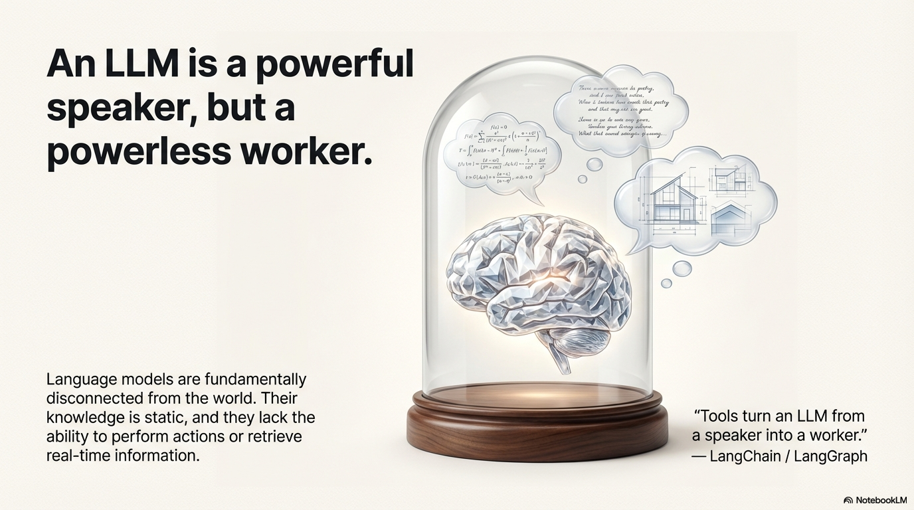
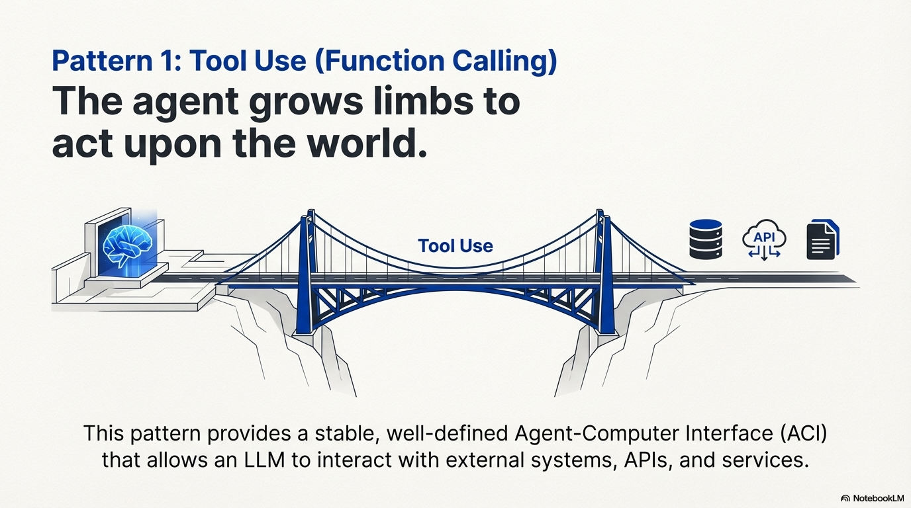
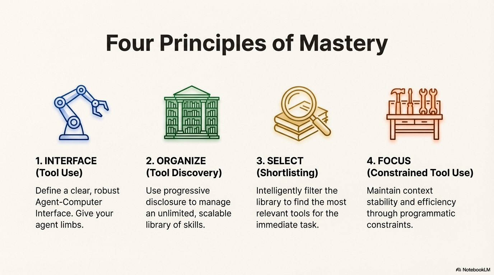

# Pattern: Tool Use

## Motivation

Humans extend their capabilities through tools: a hammer for construction, a calculator for math, a smartphone for communication. 
Each tool has a clear purpose, specific instructions for use, and predictable results when used correctly. 
Just as we learn to use tools by understanding their function and boundaries, agents need well-defined tools with clear descriptions, parameters, and constraints. 
The Tool Use pattern creates this interface between an agent's reasoning and the external world.

> **"Tools give models new limbs."** — Andrej Karpathy



## Pattern Overview

### Problem

LLMs are powerful text generators, but they are fundamentally disconnected from the outside world. Their knowledge is static, limited to training data, and they lack the ability to perform actions or retrieve real-time information. When an agent needs to break out of the LLM's internal knowledge and interact with the outside world, it cannot perform tasks requiring real-time data, access private or proprietary information, perform precise calculations, execute code, or trigger actions in other systems. Without tools, LLMs remain text generators incapable of sensing, reasoning, and acting in the digital or physical world.

### Solution

Tool Use (also known as Function Calling) is the pattern that enables agents to interact with external systems, APIs, databases, and services. It bridges the gap between an LLM's reasoning capabilities and the external world, allowing agents to perform actions, retrieve real-time data, execute code, and interact with other systems. The Tool Use pattern transforms a language model from a text generator into an agent capable of sensing, reasoning, and acting in the digital or physical world.

The success of tool use relies critically on the quality and robustness of the **Agent-Computer Interface (ACI)**. The ACI is the tightly controlled, isolated execution runtime where the LLM's generated commands are translated into executable, verifiable code. Just as a poor UI confuses a human user, poorly defined, ambiguous, or unreliable tools lead to agent hallucinations, costly loops, and ultimate failure. Well-designed tools with clear descriptions, parameters, and constraints enable agents to reliably interact with external systems and extend their capabilities beyond their training data.

> **"Tools turn an LLM from a speaker into a worker."** — LangChain / LangGraph




### Key Concepts

- **Function Calling:** The technical mechanism where an LLM generates structured output (often JSON) specifying which function to call and with what arguments.
- **Tool Definition:** Clear descriptions of external functions or capabilities, including purpose, parameters, types, and boundaries.
- **Agent-Computer Interface (ACI):** The standardized contract between the generative model (planner) and the code execution environment (executor).
- **Idempotency:** A critical principle where a tool call should produce the same observable side effect regardless of how many times it is executed.
- **Tool Execution:** The orchestration layer that intercepts structured tool calls, executes the actual function, and returns results to the agent.
- **Observation:** The structured result returned from tool execution that the agent uses to inform its next decision.

### How It Works

The Tool Use pattern operates through a structured process:

1. **Tool Definition:** External functions or capabilities are defined and described to the LLM. This description includes the function's purpose, name, parameters, types, and what it cannot do.
2. **LLM Decision:** The LLM receives the user's request and available tool definitions. Based on its understanding, it decides if calling one or more tools is necessary to fulfill the request.
3. **Function Call Generation:** If the LLM decides to use a tool, it generates structured output (often JSON) specifying the tool name and arguments extracted from the user's request.
4. **Tool Execution:** The orchestration layer intercepts this structured output, identifies the requested tool, and executes the actual external function with the provided arguments.
5. **Observation/Result:** The output or result from tool execution is returned to the agent as an observation.
6. **LLM Processing:** The LLM receives the tool's output as context and uses it to formulate a final response or decide on the next step (which might involve calling another tool, reflecting, or providing a final answer).

While "function calling" describes invoking specific, predefined code functions, "tool calling" is a broader concept. A tool can be a traditional function, a complex API endpoint, a database request, or even an instruction directed at another specialized agent. This perspective enables sophisticated systems where agents orchestrate across diverse digital resources and intelligent entities.

## When to Use This Pattern

### ✅ Use this pattern when:

- **Real-time data needed:** Tasks requiring current information not in the LLM's training data (weather, stock prices, news).
- **External system interaction:** Tasks that need to interact with APIs, databases, file systems, or other services.
- **Precise calculations required:** Tasks needing deterministic computations that LLMs cannot perform reliably.
- **Code execution needed:** Tasks requiring running code snippets in a safe environment.
- **Action triggering:** Tasks that need to trigger actions in other systems (send emails, control devices, update databases).
- **Private/proprietary data access:** Tasks requiring access to user-specific or company-specific information not in public training data.
- **Dynamic information retrieval:** Tasks that need to search, query, or retrieve information from external sources.

### ❌ Avoid this pattern when:

- **Pure text generation:** Tasks that only require generating text based on the LLM's training data.
- **No external dependencies:** Tasks that can be completed entirely within the LLM's knowledge and reasoning capabilities.
- **Simple Q&A:** Basic questions that can be answered from the model's training data without external lookup.
- **Cost-sensitive scenarios:** When the overhead of tool calls (latency, API costs) outweighs benefits.
- **Security-critical systems:** When tool execution introduces unacceptable security risks that cannot be mitigated.

### Decision Guidelines

Use Tool Use when the task requires information or capabilities beyond what the LLM can provide from its training data alone. 
If the task needs real-time data, interaction with external systems, or the ability to perform actions, Tool Use is essential. 
However, if the task can be completed with the LLM's internal knowledge and reasoning, avoid adding unnecessary complexity.

## Practical Applications & Use Cases

The Tool Use pattern is applicable in virtually any scenario where an agent needs to go beyond generating text to perform an action or retrieve specific, dynamic information:

### 1. Information Retrieval from External Sources
**Use Case:** A weather agent that provides current weather conditions.

- **Tool:** A weather API that takes a location and returns current weather conditions.
- **Agent Flow:** User asks "What's the weather in London?", LLM identifies the need for the weather tool, calls the tool with "London", tool returns data, LLM formats the data into a user-friendly response.

### 2. Interacting with Databases and APIs
**Use Case:** An e-commerce agent that checks inventory and order status.

- **Tools:** API calls to check product inventory, get order status, or process payments.
- **Agent Flow:** User asks "Is product X in stock?", LLM calls the inventory API, tool returns stock count, LLM tells the user the stock status.

### 3. Performing Calculations and Data Analysis
**Use Case:** A financial agent that calculates profits and analyzes stock data.

- **Tools:** A calculator function, a stock market data API, a spreadsheet tool.
- **Agent Flow:** User asks "What's the current price of AAPL and calculate the potential profit if I bought 100 shares at $150?", LLM calls stock API, gets current price, then calls calculator tool, gets result, formats response.

### 4. Sending Communications
**Use Case:** A personal assistant agent that sends emails.

- **Tool:** An email sending API.
- **Agent Flow:** User says "Send an email to John about the meeting tomorrow.", LLM calls an email tool with the recipient, subject, and body extracted from the request.

### 5. Executing Code
**Use Case:** A coding assistant agent that runs and analyzes code.

- **Tool:** A code interpreter.
- **Agent Flow:** User provides a Python snippet and asks "What does this code do?", LLM uses the interpreter tool to run the code and analyze its output.

### 6. Controlling Other Systems or Devices
**Use Case:** A smart home agent that controls IoT devices.

- **Tool:** An API to control smart lights.
- **Agent Flow:** User says "Turn off the living room lights." LLM calls the smart home tool with the command and target device.

## Implementation

### Engineering Best Practices

#### 1. Explicit Tool Definitions & Quality
Tools must have clear, distinct descriptions, strict boundaries, and required parameters.
The quality of the tool description directly impacts the model's accuracy. Descriptions must detail:

- **Purpose:** What the tool solves
- **Boundaries:** What it cannot do
- **Parameter Names:** Use descriptive, obvious parameter names that make their purpose clear (e.g., `absolute_filepath` instead of `path`, `user_email_address` instead of `email`)
- **Parameter Types:** Clearly specify types and formats for all parameters
- **Negative examples:** Show the agent when not to use a tool (e.g., "Do not use search_api for real-time stock quotes; use get_stock_price instead")
- **Example Usage:** Include example usage to illustrate how the tool should be called

Use structured data types (like Pydantic schemas in Python or TypeScript interfaces) to enforce type safety and parameter validation. The docstring for the tool should be the single source of truth for the model's understanding.

**Put yourself in the model's shoes:** Is it obvious how to use this tool based on the description and parameters? If you need to think carefully about it, the model will too. A good tool definition often includes example usage, edge cases, input format requirements, and clear boundaries from other tools.

#### 1.5. Tool Design: Choosing LLM-Friendly Formats

When designing tools, there are often multiple ways to specify the same action. However, some formats are significantly more difficult for LLMs to generate correctly than others. The format you choose can dramatically impact reliability and error rates.

**Key Principles for Tool Format Selection:**

1. **Give the model enough tokens to "think" before writing itself into a corner**

    - Avoid formats that require precise counts or calculations before generation
    - Example: Writing a diff requires knowing how many lines are changing in the chunk header before the new code is written—this is error-prone for LLMs

2. **Keep formats close to what models see naturally in training data**

    - Formats that appear frequently in the model's training corpus are easier to generate
    - Example: Code in markdown code blocks is more natural than code inside JSON strings

3. **Minimize formatting "overhead"**

    - Avoid formats that require complex escaping, counting, or precise formatting
    - Example: Writing code inside JSON requires extra escaping of newlines and quotes, making it harder for the model
    - Example: Requiring accurate line counts for thousands of lines of code is error-prone

**Practical Examples:**

**❌ Avoid: Diff-based file editing**

??? "Example: Avoid Diff-based Editing"

    ```python
    # Difficult for LLMs - requires precise line counting
    def edit_file(filepath: str, diff: str) -> str:
        """
        Edit a file using a diff format.
        diff format: '@@ -start_line,count +start_line,count @@'
        Example: '@@ -5,3 +5,4 @@\n old line 1\n-old line 2\n+new line 2'
        """
    ```

**✅ Prefer: Full file replacement or append operations**

??? "Example: Prefer Full File Replacement"

    ```python
    # Easier for LLMs - no line counting required
    def write_file(filepath: str, content: str) -> str:
        """
        Write content to a file. If file exists, replaces it entirely.
        content: The complete file contents as a string.
        """
    ```

**❌ Avoid: Code in JSON strings**

??? "Example: Avoid Code in JSON"

    ```python
    # Requires escaping newlines and quotes
    def execute_code(code_json: str) -> str:
        """
        Execute code provided as JSON string.
        Example: {"code": "def hello():\n    print('hi')"}
        """
    ```

**✅ Prefer: Code in markdown or plain text**

??? "Example: Prefer Code in Plain Text"

    ```python
    # Natural format, no escaping needed
    def execute_code(code: str) -> str:
        """
        Execute Python code provided as a string.
        Code should be valid Python syntax.
        """
    ```

**Poka-Yoke (Error-Proofing) Your Tools:**

Apply the Japanese concept of "poka-yoke" (mistake-proofing) to tool design by making it harder for the model to make mistakes:

- **Use absolute paths instead of relative paths:** After an agent changes directories, relative paths become ambiguous. Requiring absolute paths eliminates this source of error.
- **Use structured types instead of free-form strings:** Instead of accepting a date as "2024-01-15" or "January 15, 2024", require a specific ISO format.
- **Provide clear boundaries:** Explicitly state what the tool cannot do to prevent misuse.
- **Use descriptive parameter names:** Parameter names should make their purpose obvious (e.g., `absolute_filepath` instead of `path`).

When building a coding agent for SWE-bench, Anthropic found that the model made mistakes with tools using relative filepaths after the agent had moved out of the root directory. 
By changing the tool to always require absolute filepaths, the model used the method flawlessly.

**Rule of Thumb:**

Think about how much effort goes into Human-Computer Interfaces (HCI), and invest similar effort in creating good Agent-Computer Interfaces (ACI). 
Put yourself in the model's shoes: Is it obvious how to use this tool based on the description and parameters? 
If you need to think carefully about it, the model will too. 
A good tool definition often includes example usage, edge cases, input format requirements, and clear boundaries from other tools.

#### 2. Input & Output Validation and Pruning
Add a crucial layer of security and robustness between the LLM and external systems:

- **Pre-Execution Checks:** Verify that parameters generated by the LLM (file paths, database IDs, amounts) are safe, adhere to business logic (non-negative financial values, date ranges), and prevent security risks like path traversal attacks or injection attempts.
- **Post-Execution Sanitization:** Simplify and prune complex, nested JSON or verbose API outputs into concise, token-efficient observations. 
Use structured querying languages (like JQ or JSONPath) to extract only the most relevant fields, preventing context window bloat.

#### 3. Handling Context Switching
When a tool is called, the orchestrator needs to pause the LLM's reasoning chain, execute the tool, and resume by injecting the observation. 
This context switch must be seamless. 
Prepend the observation directly to the history, ensuring it acts as the most recent, high-attention piece of data, mitigating the "Lost in the Middle" problem.

#### 4. Constrained Tool Use & Execution Guardrails
Implement safety mechanisms to prevent harmful, costly, or unproductive behavior:

- **Safety and Recursive Guardrails:** Set strict maximum number of steps in the ReAct loop, use exponential backoff for retries, and proactively block recursive calls (same tool with same input repeatedly).
- **Cost and Rate Monitoring:** Implement runtime counters and alerts for expensive tools, enforce per-session and global rate limits on external APIs.
- **Tool Sandbox Isolation:** Fully sandbox the execution environment, particularly for tools that execute arbitrary code. Use containerization technologies like Docker or gVisor to ensure agent actions are strictly constrained.

#### 5. Tool Result Management (Retrieve-then-Read)
For large tool outputs, use a two-step process:

- **Retrieve:** Get a pointer, list of resource IDs, or brief summary
- **Read:** Selectively pull in only specific, relevant content snippets based on reasoning

This minimizes token consumption by avoiding full dumps of large data into the context.

#### 6. Hierarchical Action Spaces: Managing Tool Complexity

Providing an LLM with 100+ tools leads to **Context Confusion**, where the model hallucinates parameters, calls the wrong tool, or becomes overwhelmed by choice. 
This is a failure mode where the LLM cannot distinguish between instructions, data, and structural markers due to too much information competing for attention.

**The Three-Level Hierarchical Action Space:**

Organize tools into a hierarchical structure that progressively reveals complexity, keeping the core action space small and manageable:

**Level 1 (Atomic - ~20 Core Tools):**

The model sees approximately 20 core, stable tools that form the foundation of agent capabilities. These should be:
- **Essential and frequently used:** Core operations like `file_write`, `file_read`, `browser_navigate`, `bash`, `search`
- **Stable:** Tool definitions rarely change, maximizing KV-cache efficiency
- **Cache-friendly:** Consistent usage patterns enable better prompt caching

Example core tools:
- `file_write` - Write content to files
- `file_read` - Read files with optional line ranges
- `browser_navigate` - Navigate web pages
- `bash` - Execute shell commands
- `search` - Semantic or keyword search

**Level 2 (Sandbox Utilities):**

Instead of creating a specific tool for every utility (e.g., `grep`, `ffmpeg`, `curl`), instruct the model to use the `bash` tool (from Level 1) to call utilities via CLI. 
This keeps tool definitions out of the context window while still providing access to system capabilities.

**Example:** Instead of defining a `grep_file` tool:
- Use the `bash` tool with instruction: "You can use bash to call grep: `bash('grep -r pattern /path/to/dir')`"
- Systems like Manus use `mcp-cli <command>` pattern, keeping CLI utilities accessible without cluttering tool definitions

**Level 3 (Code/Packages):**

For complex logic chains requiring multiple steps (e.g., "Fetch city name → Get city ID → Get weather data"), don't make 3 separate LLM roundtrips. Instead:
- Provide libraries or functions that handle the complete logic chain
- Let the agent write a dynamic script using the `bash` or code execution tool
- Encapsulate multi-step operations into single function calls

**Example:** Instead of three tools (`get_city_id`, `fetch_weather_by_id`, `format_weather_response`):
- Provide a single `get_weather_for_city(city_name: str)` function that handles the entire chain internally
- Or enable the agent to write a Python script that does all three steps in one execution

**Why This Works:**

- **Reduces Context Confusion:** ~20 core tools are manageable for the model to reason about
- **KV-Cache Optimization:** Stable core tools enable better prompt caching
- **Flexibility:** Level 2 and 3 provide access to specialized capabilities without bloating the core action space
- **Scalability:** New utilities and capabilities can be added without modifying core tool definitions

**Critical Warning: Don't Use RAG for Tool Definitions**

Fetching tool definitions dynamically per step based on semantic similarity often fails. This approach:

- Creates shifting context that breaks KV-cache (different tools appear/disappear between turns)
- Confuses the model with "hallucinated" tools that were present in turn 1 but disappeared in turn 2
- Increases latency through additional retrieval steps
- Makes tool usage unpredictable and harder to debug

**Best Practice:**

Maintain a stable, hierarchical tool set. 
Use the three-level structure to balance capability with clarity.
Tools should be visible and consistent throughout a conversation, not dynamically retrieved based on similarity. 
If tools must change, do so at session boundaries, not mid-conversation.

**Relationship to Other Patterns:**

- **Pattern: Shortlisting** - Can be used to select from Level 1 core tools, but the core set should remain small and stable
- **Pattern: Constrained Tool Use** - Logit masking can enforce Level 1/2/3 boundaries, ensuring the model only sees appropriate tools for the current context
- **Pattern: Tool Discovery** - Organizes tools into skills with progressive disclosure, enabling scalable tool management while maintaining the hierarchical structure



### Code Examples

??? "LangGraph Implementation"

    ```python
    from langchain_google_genai import ChatGoogleGenerativeAI
    from langchain_core.tools import tool
    from langgraph.prebuilt import create_react_agent

    llm = ChatGoogleGenerativeAI(model="gemini-2.0-flash", temperature=0)

    @tool
    def search_information(query: str) -> str:
        """Provides factual information on a given topic."""
        results = {
            "weather in london": "The weather in London is currently cloudy with a temperature of 15°C.",
            "capital of france": "The capital of France is Paris.",
        }
        return results.get(query.lower(), f"Information about: {query}")

    agent = create_react_agent(
        llm,
        [search_information],
        state_modifier="You are a helpful assistant."
    )

    response = agent.invoke({
        "messages": [{"role": "user", "content": "What is the capital of France?"}]
    })
    print(response["messages"][-1].content)
    ```

??? "CrewAI Implementation"

    ```python
    from crewai import Agent, Task, Crew
    from crewai.tools import tool

    @tool("Stock Price Lookup Tool")
    def get_stock_price(ticker: str) -> float:
        """Fetches the latest simulated stock price for a given stock ticker symbol."""
        prices = {"AAPL": 178.15, "GOOGL": 1750.30, "MSFT": 425.50}
        return prices.get(ticker.upper(), 0.0)

    agent = Agent(
        role='Financial Analyst',
        goal='Analyze stock data using provided tools.',
        backstory="You are an experienced financial analyst.",
        tools=[get_stock_price],
        verbose=True
    )

    task = Task(
        description="What is the current stock price for Apple (ticker: AAPL)?",
        expected_output="The simulated stock price for AAPL.",
        agent=agent
    )

    crew = Crew(agents=[agent], tasks=[task], verbose=True)
    result = crew.kickoff()
    print(result)
    ```

??? "Google ADK Implementation"

    ```python
    from google.adk.agents import Agent as ADKAgent
    from google.adk.runners import Runner
    from google.adk.sessions import InMemorySessionService
    from google.adk.tools import google_search
    from google.genai import types

    agent = ADKAgent(
        name="search_agent",
        model="gemini-2.0-flash-exp",
        description="Agent to answer questions using Google Search.",
        instruction="I can answer your questions by searching the internet.",
        tools=[google_search]
    )

    session_service = InMemorySessionService()
    runner = Runner(agent=agent, app_name="search_app", session_service=session_service)

    content = types.Content(role='user', parts=[types.Part(text="what's the latest ai news?")])
    events = runner.run(user_id="user1", session_id="session1", new_message=content)

    for event in events:
        if event.is_final_response():
            print(event.content.parts[0].text)
    ```

## Key Takeaways

- **Tool Use (Function Calling)** allows agents to interact with external systems and access dynamic information beyond their training data.
- **Agent-Computer Interface (ACI)** is the critical contract between the LLM and execution environment, requiring careful design for reliability and security.
- **Idempotency** is essential: tool calls should produce the same observable side effect regardless of execution count.
- **Tool definitions** must be clear, detailed, and include boundaries and negative examples to guide proper usage.
- **Input/output validation** adds crucial security and robustness layers between the LLM and external systems.
- **Hierarchical Action Spaces** prevent Context Confusion by organizing tools into three levels: ~20 core atomic tools (stable, cache-friendly), sandbox utilities (via bash/CLI), and code/packages (encapsulated logic chains).
- **Avoid dynamic RAG-based tool retrieval** - it breaks KV-cache, creates shifting contexts, and confuses models with tools that appear and disappear.
- **Frameworks** like LangGraph, CrewAI, and Google ADK provide abstractions that simplify tool integration and execution.
- **Google ADK** includes pre-built tools like Google Search, Code Execution, and Vertex AI Search that can be directly integrated.
- **Tool Use** transforms language models from text generators into agents capable of real-world action and up-to-date information retrieval.

> **"An agent is a *policy* over tools, wrapped around a language model."** — Manus Creators

## Related Patterns

- **Planning:** Tool Use often works in conjunction with Planning, where agents create structured plans that include tool calls as steps.
- **Routing:** Routing can determine which tools are available or appropriate based on context or user permissions.
- **Reflection:** Tool results can be evaluated and refined through Reflection patterns.
- **Multi-Agent Architectures:** Different agents can have different tool sets, enabling specialization.
- **Exception Handling:** Robust error handling is critical when tools fail or return unexpected results.
- **Memory Management:** Tool results may need to be stored in external memory systems for later retrieval.

??? "References"

    - LangGraph Documentation (Tool Calling): https://langchain-ai.github.io/langgraph/how-tos/tool-calling/
    - Google Agent Developer Kit (ADK) Documentation (Tools): https://google.github.io/adk-docs/tools/
    - OpenAI Function Calling Documentation: https://platform.openai.com/docs/guides/function-calling
    - CrewAI Documentation (Tools): https://docs.crewai.com/concepts/tools
    - Context Engineering for AI Agents: Part 2 - https://www.philschmid.de/context-engineering-part-2
