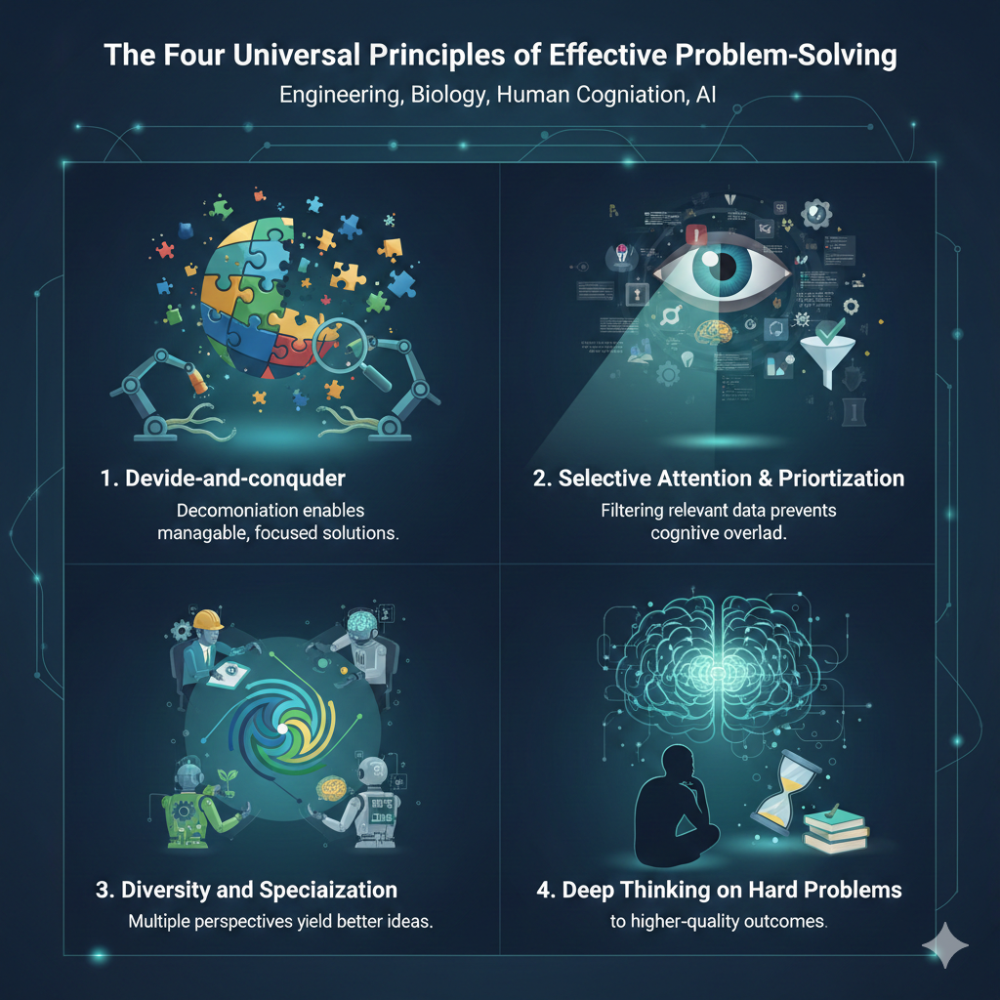

# What is an Agentic Design Pattern?

Before diving into specific patterns, it's essential to understand what we mean by an "agentic design pattern" and how it differs from concrete implementations, frameworks, or libraries.

A **design pattern** is an abstract, reusable solution to a recurring problem in system design. 
It's not a specific piece of code or a library you can import. Instead, it's a **template** or **blueprint** that describes:

1. **The Problem:** A recurring challenge that appears across different agentic systems
2. **The Solution Structure:** An abstract approach to solving that problem
3. **The Trade-offs:** Benefits and limitations of applying this solution
4. **When to Use It:** Contexts where this pattern is appropriate
5. **When Not to Use It:** Situations where alternative approaches are better

Design patterns are **technology-agnostic**. 
The same pattern can be implemented using different frameworks (LangChain, LangGraph, Google ADK, CrewAI), different programming languages, or even different model providers. The pattern describes the *what* and *why*, while implementations show the *how*.

--- 

## The Four Universal Principles of Effective Problem-Solving

When building intelligent systems, whether biological or artificial, we find that effective problem-solving consistently reflects four universal principles. 
These principles are not domain-specific—they represent fundamental aspects of how intelligence itself operates, transcending whether we're designing human cognition, biological systems, or AI agents. 
The agentic design patterns in this book work precisely because they are grounded in these general principles of intelligence, which is why similar patterns emerge repeatedly across natural and artificial systems.

1. **Devide-and-conquer** — Decomposition enables manageable, focused solutions. 
By dividing complex challenges into discrete, addressable components, we can tackle each piece systematically, reducing cognitive load and improving the likelihood of success.

2. **Selective Attention & Prioritization** — Selective attention prevents cognitive overload and improves decision quality. 
Rather than processing all available information, effective problem-solving requires filtering and prioritizing the most relevant data for the current sub-problem.

3. **Diversity and Specialization** — Multiple parties collaborating on a problem is better than a single entity; the different biases and perspectives each brings return the best ideas. Specialized agents or team members, each with distinct expertise and viewpoints, can explore solution spaces more thoroughly than any single generalist.

4. **Deep Thinking on Hard Problems** — Reflected in more energy investment to get the best solution—like reflection. Deliberate, iterative consideration of problems and solutions leads to higher-quality outcomes than hasty, single-pass approaches.

---

## Why Design Patterns Matter: A Cognitive Framework

This complexity is precisely why agentic design patterns are indispensable. They are not rigid rules, but rather battle-tested templates or blueprints that offer proven approaches to standard design and implementation challenges in the agentic domain. By recognizing and applying these design patterns, you gain access to solutions that enhance the structure, maintainability, reliability, and efficiency of the agents you build.

The patterns presented in this book were extracted through careful analysis and dissection of real-world agent implementations, including systems like IBM's CUGA (Configurable Generalist Agent) and LangChain's Deep Agents. By examining how successful agent architectures are constructed, we've identified reusable patterns, design components, and principles that can be applied across different agentic systems. This pattern extraction methodology allows us to learn from proven implementations and codify their best practices into transferable knowledge.

A great question we often hear is: "With AI changing so fast, why write a book that could be quickly outdated?" Our motivation is actually the opposite. It's precisely because things are moving so quickly that we need to step back and identify the underlying principles that are solidifying. Patterns like RAG, Reflection, Routing, Memory Management, Multi-Agent Coordination, and the others we discuss are becoming fundamental building blocks. More importantly, the cognitive principles underlying these patterns—how working memory works, how attention is allocated, how complex problems are decomposed—these are universal principles of intelligence that transcend specific technologies.

This book goes further: it provides AI agent engineers with a **shared conceptual language grounded in cognitive neuroscience**, enabling you to build intelligent problem solvers with a common understanding of how intelligence works. Cognitive neuroscience has spent decades studying how humans break down complex problems, focus attention, delegate work to tools or collaborators, integrate partial results, and improve through experience. These theories offer deep insights into the **structure and limitations of intelligence**—working memory constraints, cognitive load, executive control bottlenecks.

Until the recent surge of LLMs, these cognitive theories seldom translated cleanly into engineering practice. Conversely, AI agent frameworks (e.g., ReAct, RAG pipelines, LangGraph, multi-agent orchestration) provide pragmatic mechanisms for controlling LLM-based agents but often lack a unifying cognitive perspective that explains *why* certain patterns work and how they relate to fundamental principles of intelligence. By grounding agent design in cognitive principles, this framework helps engineers understand the limits of intelligence while inspiring effective solutions that map naturally onto existing agentic architectures.

In agentic systems, these patterns address fundamental questions:

* How do you structure sequential operations?
* How do you manage state and context within working memory constraints?
* How do you handle errors and unexpected situations?
* How do you coordinate multiple agents and allocate cognitive load?
* How do you ensure quality and safety?

By recognizing and applying these patterns with an understanding of their cognitive foundations, you gain access to solutions that enhance structure, maintainability, reliability, and efficiency. Patterns provide a common language that makes your agent's logic clearer and easier to understand, maintain, and extend. More importantly, this shared vocabulary—grounded in cognitive science—allows teams to reason about cognitive operations, understand the limits of intelligence, and communicate design decisions with a principled foundation.

Using design patterns helps you avoid reinventing fundamental solutions and accelerates development, allowing you to focus on the unique aspects of your application rather than foundational mechanics. By connecting engineering practice with cognitive principles, we can build more robust, reliable, and effective agentic systems.

> **"Software will be written for humans and for AIs — two different users."** — Andrej Karpathy

---

## What Makes a Pattern "Agentic"?

An **agentic design pattern** is a design pattern specifically tailored to the unique challenges of building AI agent systems. These patterns address problems that arise when:

- **LLMs make autonomous decisions** about tool usage and action sequences
- **Systems operate in dynamic, unpredictable environments** where the solution path isn't predetermined
- **Probabilistic models** require different reliability and error-handling approaches than deterministic code
- **Context windows are finite** and must be managed strategically
- **Multiple agents collaborate** and need coordination mechanisms
- **Human oversight** must be integrated into autonomous workflows

Agentic design patterns differ from traditional software design patterns (like Singleton, Factory, Observer) because they account for the unique characteristics of LLM-based systems: non-determinism, context limitations, tool integration, and the need for transparency in decision-making.

> **"Determinism comes not from the LLM, but from the graph around it."** — LangChain / LangGraph

---

## The Relationship Between Patterns and Implementations

It's crucial to distinguish between:

- **The Pattern (Abstract):** The reusable solution template
  - Example: "The Reflection pattern enables agents to evaluate and refine their outputs through iterative feedback loops"
- **The Implementation (Concrete):** A specific realization of the pattern using particular technologies
  - Example: "Using LangGraph to implement a Producer-Critic reflection loop with Gemini 2.0"
- **The Framework (Tool):** A library or system that provides abstractions for implementing patterns
  - Example: "LangGraph provides state management and conditional edges that make it easier to implement the Reflection pattern"

In this book, each pattern module includes:

- **Pattern Overview:** The abstract description of the problem and solution
- **When to Use:** Guidance on recognizing the recurring problem
- **Implementation Examples:** Concrete code showing how the pattern can be realized
- **Framework-Specific Examples:** How different tools can be used to implement the same pattern

---

## Characteristics of Good Design Patterns

Effective agentic design patterns share these characteristics:

1. **Abstraction:** They describe solutions at a conceptual level, not tied to specific technologies
2. **Reusability:** They can be applied across different domains, use cases, and technical stacks
3. **Proven:** They represent solutions that have been tested and refined through real-world application
4. **Composable:** They can be combined with other patterns to solve complex problems
5. **Documented Trade-offs:** They clearly explain benefits, limitations, and when alternatives are better

---

## Patterns vs. Frameworks vs. Libraries

Understanding these distinctions helps you choose the right tool for the right job:

| Aspect | Design Pattern | Framework | Library |
|--------|---------------|-----------|---------|
| **Nature** | Abstract solution template | Concrete implementation tool | Reusable code components |
| **Level** | Conceptual/Architectural | Application structure | Code utilities |
| **Portability** | Technology-agnostic | Framework-specific | Language/library-specific |
| **Example** | "Orchestrator-Worker pattern" | "LangGraph framework" | "LangChain tools library" |
| **Purpose** | Solve recurring problems | Provide structure for apps | Provide reusable functions |

**Patterns** tell you *what* to build and *why*. **Frameworks** help you *how* to build it. **Libraries** give you the *pieces* to build with.

---

## Patterns vs. Implementation Mechanisms

A common source of confusion is distinguishing between **patterns** (abstract solutions) and **implementation mechanisms** (concrete tools or APIs used to realize patterns). This distinction is crucial for understanding that the same pattern can be implemented in multiple ways.

### What Are Implementation Mechanisms?

**Implementation mechanisms** are concrete, framework-specific tools or APIs that provide a way to realize a pattern. Examples include:

- **Middleware** (LangChain's `BaseMiddleware`): A framework API for intercepting agent execution
- **Decorators** (Python): Language features for wrapping functions
- **Hooks** (React-style): Callback mechanisms for lifecycle events
- **Interceptors** (Spring-style): Framework components for cross-cutting concerns
- **Event listeners**: Mechanisms for subscribing to system events

### The Key Distinction

**The pattern is the abstract solution; the implementation mechanism is one way to build it.**

For example:

- **Pattern:** "Context Editing" — the abstract concept of automatically managing conversation context to stay within token limits
- **Implementation mechanisms:**

    - LangChain's `BaseMiddleware` API
    - Python decorators wrapping agent functions
    - SDK-level compaction features
    - Server-side API configuration

All of these mechanisms can implement the same Context Editing pattern, but they're different concrete tools.

### Why This Matters

Understanding this distinction helps you:

1. **Recognize patterns across frameworks:** When you see middleware in LangChain, decorators in Python, or hooks in React, you can identify the underlying pattern they're implementing
2. **Adapt patterns to your stack:** If a pattern is shown using middleware but you're using a different framework, you can implement it using that framework's equivalent mechanism
3. **Avoid framework lock-in:** Patterns are portable; implementation mechanisms are not. Learning the pattern means you can apply it anywhere
4. **Combine mechanisms:** You might use multiple mechanisms (middleware + decorators + event listeners) to implement a single pattern

### In This Book

Throughout this book, you'll see patterns illustrated with specific implementation mechanisms (often LangChain middleware, LangGraph nodes, or Python decorators). Remember:

- **The pattern description** explains the abstract solution (the *what* and *why*)
- **The code examples** show one way to implement it (the *how* using specific mechanisms)
- **Your implementation** may use different mechanisms while following the same pattern structure

The pattern is the reusable knowledge. The implementation mechanism is just one tool in your toolbox.

---

## How to Use This Book's Patterns

When you encounter a pattern in this book:

1. **Understand the Problem:** Recognize the recurring challenge the pattern addresses
2. **Learn the Solution Structure:** Understand the abstract approach, not just the code
3. **Identify When It Applies:** Determine if your situation matches the problem context
4. **Adapt the Implementation:** Use the examples as starting points, but adapt them to your specific needs, framework, and constraints
5. **Combine Patterns:** Real systems often use multiple patterns together

Remember: **The pattern is the abstraction. The code examples are illustrations.** Your implementation will differ based on your specific requirements, but the core pattern structure remains the same.

> **"Stateless models can't build relationships — agents can."** — Andrej Karpathy

---

## Next Steps

Now that you understand what agentic design patterns are, you're ready to explore the specific patterns in this book. Each pattern module follows a consistent structure:

- **Pattern Overview:** What the pattern is and why it matters
- **When to Use:** Guidance on recognizing when this pattern applies
- **Practical Applications:** Real-world use cases
- **Implementation:** Code examples showing how to realize the pattern
- **Key Takeaways:** Summary of the pattern's core concepts

Proceed to the pattern modules to begin learning how to apply these abstract solutions to your specific agentic system challenges.

